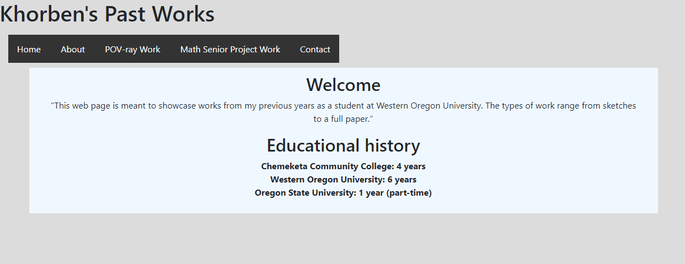

## Homework 1

For this first homework, we were responsible for learning a basic working knowledge of the HTML, CSS, and Markdown languages. In the course of this, the setting up of a github repository was carrried out as seen in the link below. Throughout the homework, we were practicing the use of various essential git commands. Furthermore, the site demo links to a set of simple webpages meant to showcase the use of HTML and CSS. The styling of the pages was carried out using the common package Bootstap - a CSS and Javascript library good for page layouts - as well as our own mini CSS file.

### Homework 1 Links
1. [Home page](https://no-one-alone.github.io/)
2. [Assignment Page](http://www.wou.edu/~morses/classes/cs46x/assignments/HW1.html)
3. [Code Repository](https://github.com/No-one-alone/no-one-alone.github.io)
4. [Final Site Demo](https://no-one-alone.github.io/Homework_1/index.html)


### Part 1: Downloading Git, Using an account on GitHub to create a repository

I first downloaded the command line version of the Git version control system from this [site](https://git-scm.com/) and selected the appropriate options as part of the setup process. Git bash with Linux commands was used to setup the respository in the following manner:

First, I created and setup an empty Git repository on Github following directions from [here](https://help.github.com/articles/creating-a-new-repository/) This was followed by opening Git bash, creating a local project in the appropriate folder, navigating to it, and executing these command to initialize the local directory on my machine as a Git repository:

``` bash
    git init
```

My project files were then added to this new local repository via:
``` bash
    git add .
```

With this staging accomplished. I was ready for my first commit:
``` bash
    git commit - m "First commit"
```

Next, I went to my GitHub repository and retrieved my new repository's remote repository URL
Then, back in the command prompt, I added the url as it was needed to determine where my local repository would be pushed to and subsequently verified it:

``` bash
    git remote add origin https://github.com/No-one-alone/no-one-alone.github.io
    git remote -v
```
Finally, I pushed my project files and any changes to the repository on my GitHub account:
``` bash
    git push origin master
```

I would check the status of the working tree and its relation to the local repository and my Github account via:

``` bash
    git status
```
Overall, this sequence of commands:

``` bash
    git add .
    git commmit -m "some description of change made"
    git push origin master
```

was used to repeatedly update the GitHub repository as changes and additions were made to the project over time.

To pull the GitHub repository back to my local repository, I used:
```bash
    git pull origin master
```
But only after checking that there was nothing to update from my end.

Also, at some point, I had configure the local repository with:
```bash
    git config --global user.name "Khorben Boyer"
    git config --global user.email kboyer12@mail.wou.edu
```

### Part 2: Downloading Visual Studio IDE, Visual Studio Code, Bootstrap, and GitHub Pages

I then downloaded the Visual Studio IDE from [here](https://visualstudio.microsoft.com/vs/) followed by Visual Studio Code from this [site](https://code.visualstudio.com/). After setting these up, I downloaded Bootstrap version 4 - the open source toolkit for HTML, CSS, and Javascript - from [here](https://getbootstrap.com/). Finally, at a later point, I enabled the GitHub Pages feature on my GitHub account under the settings tab to allow for automatic serving of my created pages from my repo.

### Part 3: Coding the Project

As per the assignment specifications, I created a primary landing page, a linkded CS 460 landing page, and the Homework #1 blog page itself after choosing to use markdown language. The actual webpage portion of the assignment was created using separated html and css files.

I worked primarly on the webpage portion first starting with some standard beginning html code observed from this [site](https://www.w3schools.com/html/default.asp) and linking in the particular bootstrap css files I needed along with my own css file.

```html
<!--This my file for the Home web page for Homework#1 of CS 460-->
<!--Date finished: 10/1/2018-->

<!doctype html>
<html lang="eng">

       <!-----bootstrap part-->
       <link rel="stylesheet" href="../css/bootstrap.min.css">

       <!----my version of bootstrap css stuff----->   
       <link rel="stylesheet" type="text/css" href="styles.css">
    <head>
        <h1>
            Khorben's Past Works
        </h1>
        <meta charset="utf-8">
        <meta name="viewport" content="width=device-width, initial-scaled=1">

    </head>
```

I added my navbar or menu for the webpage via the following code.

Navbar setup
``` html
<nav class="navbar navbar-expand">
            <div class="container-fluid space">
                <ul class="nav nav-tabs">
                    <ul class="navbar-nav>">
                        <li class="nav-item">
                            <a href="index.html">Home</a>
                            <a href="about.html">About</a>
                            <a href="pov_ray_work.html">POV-ray work</a>
                            <a href="math_senior_project_work.html">Math Senior Project Work</a>
                            <a href="contact.html">Contact</a>
                        </li>
                    </ul>
                </ul>
            </div>
        </nav>

```

The html code above was then replicated another 4 times to create 5 html files in total: 

```
    index.html
    about.html
    pov_ray_work.html
    math_senior_project_work.html
    contact.html
```

a complete example of the coding for page can be seen with about.html for the About page:

```html
<!--This my file for the About web page for Homework#1 of CS 460-->
<!--Date finished: 10/1/2018-->

<!doctype html>
<html lang="eng">

    <!-----bootstrap part-->
    <link rel="stylesheet" href="../css/bootstrap.min.css">

    <!----my version of bootstrap css stuff----->   
    <link rel="stylesheet" type="text/css" href="styles.css">    
    <head>
        <h1>
            Khorben's Past Works
        </h1>
        <meta charset="utf-8">
        <meta name="viewport" content="width=device-width, initial-scaled=1">
    </head>

    <!--Work Comment: navbar structure was informed by help from fellow students-->
    <body>
        <nav class="navbar navbar-expand">
            <div class="container-fluid space">
                <ul class="nav nav-tabs">
                    <ul class="navbar-nav>">
                        <li class="nav-item">
                            <a href="index.html">Home</a>
                            <a href="about.html">About</a>
                            <a href="pov_ray_work.html">POV-ray Work</a>
                            <a href="math_senior_project_work.html">Math Senior Project Work</a>
                            <a href="contact.html">Contact</a>
                        </li>
                    </ul>
                </ul>
            </div>
        </nav>

        <div class="background">
            <div class="container">
                <div class="content">
                    <h2>
                        Statement of Intent
                    </h2>
                    <p>
                        "I have been at WOU for over 6 years.
                        In that time, I have taken many classes, met with many instructors, and worked on many projects.
                        While all have been conducive to my growth as a student, 
                        there are some of particular significance to my mind with regards to how
                        they stretched what I thought I could do or accomplish. The works referenced
                        above are examples of just these sorts of projects."
                    </p>
                    <div class="row">
                        
                            <div class="column">
                            <h2>
                                    My Majors
                            </h2>
                            <ol>
                                    <dt>Mathematics</dt>
                                    <dt>Computer Science</dt>
                                    <dt>Economics</dt>
                            </ol>
                            </div>
                            <div class="column"> <h2>
                                    My Interests
                            </h2>
                            <ol>
                                <dt>Machine Learning</dt>
                                <dt>Artificial Intelligence</dt>
                                <dt>Applied Mathematics and Statistics</dt>
                            </ol>
                        </div>
                    </div>
                </div>
            </div>
        </div>
    </body>
</html>

```


This shows what the overall file structure of my project is organized:


Here we have a picture of the actual web page

