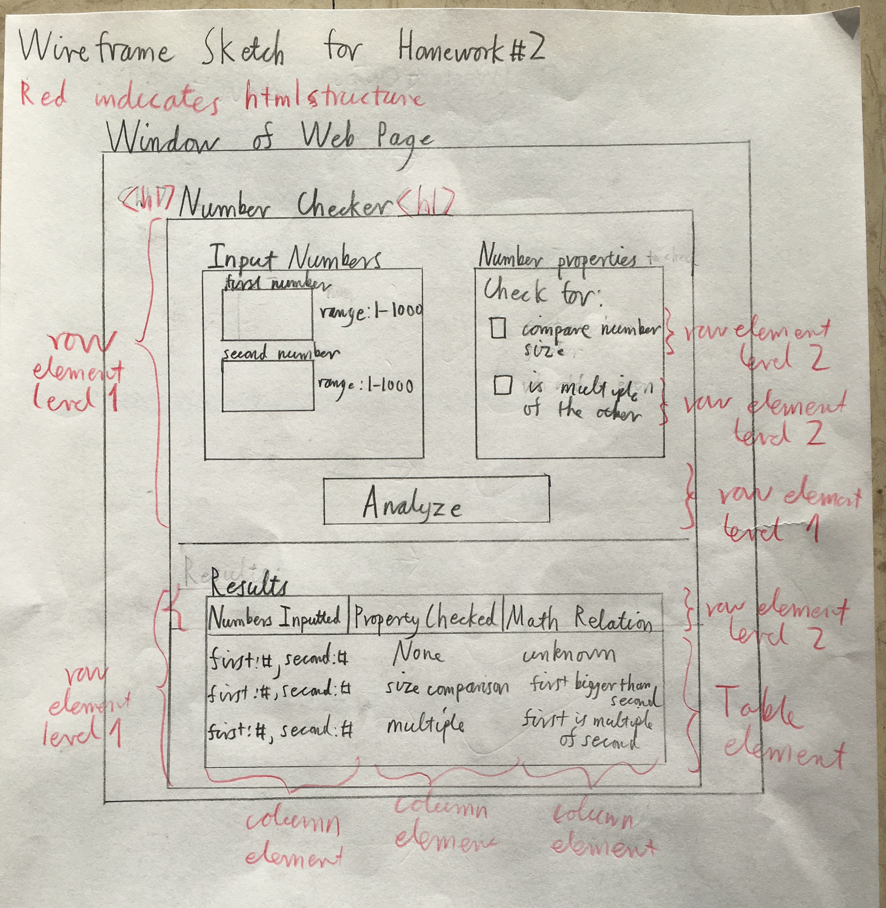
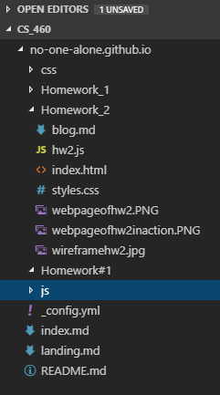
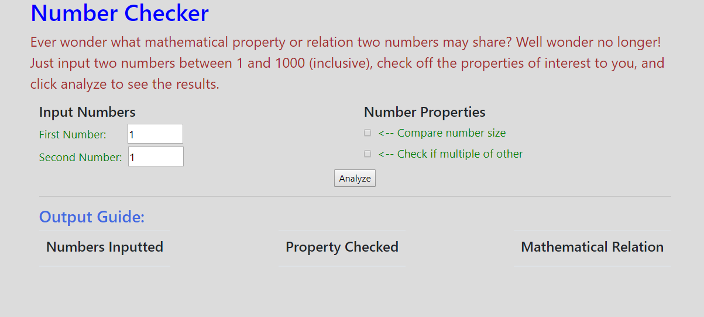
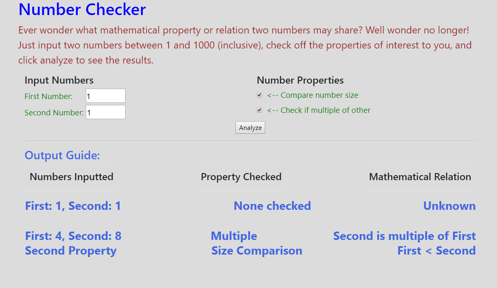

## Homework 2

For the second homework, we were responsible for learning the Javascript language, the javascript language library - jQuery, the Document Object Model (DOM) for HTML pages, how to create HTML forms, handling events caused by a user, and demonstrating additional git command knowledge. This was clearly intended to use the skills and experience gained from the first homework as our jumping off point and was thereby somewhat less challenging as I now had a foundation that was missing before. Furthermore, we were required to use the new topics in combination with HTML and CSS to create a dynamic webpage that responded to user input and action via use of Javascript and jQuery. Specifically, the user input was to be used as part of a calculation or internal logic, and to have it return results to the user in a manner that altered the webpage upon an event like clicking a button.

### Homework 2 Links
1. [Home page](https://no-one-alone.github.io/)
2. [Assignment Page](http://www.wou.edu/~morses/classes/cs46x/assignments/HW2.html)
3. [Code Repository](https://github.com/No-one-alone/no-one-alone.github.io)
4. [Final Site Demo](index.html)
5. [Final Site Video Demo](https://www.youtube.com/watch?v=Tj4R6GwUizU&feature=youtu.be)


### Part 1: Git Again.

Our new commands to learn for this week included the following

``` bash
    git branch 
    git branch featurebranchname
    git checkout branchname
    git merge featurebranchname
```

The branch command allows one to view which branches one is on in the git repository.

``` bash
    git branch 
```
Adding a name of a branch that doesn't exist results in the creation of a new branch.

``` bash
    git branch featurebranchname
```

One could then add, commit, and push on this branch just as we previously did on master.
Furthermore, we could switch between branches via this command.

``` bash
    git checkout branchname
```
Finally, once we were done with our featurebranch for homework #2, we merged it back into
the master branch with this command.

``` bash
    git merge featurebranchname
```

Note, that one must be on the branch one wishes to merge into instead of the branch to be merged into it.

### Part 2: Planning and Design

I wanted to keep it simple so I decided on designing a webpage that would check basic number properties between two numbers supplied by the user and return the results as part of a table. To help with this process, I created the following sketch of the webpage here.



This provided some early intuition how the elements and content of the webpage would need to be layed out regarding columns, rows, etc.

### Part 3: Coding the Project

As per the assignment specifications, I ended up creating the three files seen here for homework #2.

```
    index.html
    styles.css
    hw2.js
```

As you can see, I decided to keep the HTML, CSS, and Javascript/jQuery code all in separate files for both better organization as well as to be in line with more modern software design best practices.

### Part 3.1: HTML

I worked primarly on the index.html file first to get the form and content of the static webpage established. The start of the file where the various links to bootstrap, javascript, jQuery, and my own files can be seen here.

```html
<!--This is my HTML file for the Number Checker web page for Homework#2 of CS 460-->
<!--Date finished: 10/11/2018-->

<!doctype html>
<html lang="eng">

<!-----This is the link to the bootstrap part for css and js-->
<link rel="stylesheet" href="../css/bootstrap.min.css">
<script src="../js/bootstrap.min.js"></script>

<!----This is the link to my version of bootstrap css stuff----->
<link rel="stylesheet" type="text/css" href="styles.css">

<!--This is the link to my javascript file-->
<script src="hw2.js"></script>

<!--This is the link to the jQuery library I am using-->
<script src="https://ajax.googleapis.com/ajax/libs/jquery/3.3.1/jquery.min.js"></script>

<head>
    <meta charset="utf-8">
    <meta name="viewport" content="width=device-width, initial-scaled=1">

</head>
```

Next, we have the beginning of the body where the name of the webpage and a greeting to the user is placed.

```html
<body>
    <div class="container outer">
        <h1>Number Checker</h1>
        <div class="container inner">
            <div class="row">
                <div class="col-xs-12">
                    <!--Greeting to user-->
                    <p>Ever wonder what mathematical property or relation two numbers may share?
                        Well wonder no longer! Just input two numbers between 1 and 1000 (inclusive),
                        check off the properties of interest to you, and click analyze to see the results.
                    </p>
                </div>
            </div>
            <form id="numberForm" method="post">
```

Then a bit afterward, I coded the elements that would take number input from the users as seen here via use of input type "number".

```html
<!--This is the code for where user will input their numbers-->
                        <h4>Input Numbers</h4>
                        <div class="inside1">
                            <label for='first number'>First Number: &nbsp &nbsp &nbsp</label>
                            <input type="number" min="1" max="1000" value="1" id="firstinputnumber">

                        </div>
                        <div class="inside2">
                            <label for='second number'>Second Number:&nbsp</label>
                            <input type="number" min="1" max="1000" value="1" id="secondinputnumber">
                        </div>

```

In addition, I created the checkbox section using input type "checkbox" where the user could select checkbox options as follows.

```html
 <h4>Number Properties</h4>

                        <div class="row">
                            <div class="col-sm-12">
                                <div class="outside">
                                    <!--This is the compare check option-->
                                    <div class="row">
                                        <div class="col-sm-8">
                                            <input type="checkbox" id="compare" name="compare" class="check1"><label
                                                for="compare">&nbsp <-- Compare number size</label>
                                        </div>

                                    </div>

                                    <!--This is the multiple check option-->
                                    <div class="row">
                                        <div class="col-sm-8">
                                            <input type="checkbox" id="multiple" name="multiple" class="check2"><label
                                                for="multiple">&nbsp <-- Check if multiple of other</label>
                                        </div>

                                    </div>
                                </div>
                            </div>
                        </div>
```

Finally, the Output section and headings were created in this manner.

```html
 <h3>Output Guide:</h3>
            <div class="output">

                <!--Our table headings-->
                <div class=row>
                    <div class="col-sm-12">
                        <table class="table" id="outtable">
                            <thead>
                                <tr>
                                    <th>
                                        <h4>Numbers Inputted</h4>
                                    </th>
                                    <th>
                                        <h4> Property Checked</h4>
                                    </th>
                                    <th>
                                        <h4>Mathematical Relation</h4>
                                    </th>
                                </tr>
                            </thead>
                        </table>
                    </div>
                </div>
```

Now, in preparation for the Javascript/jQuery scripting portion. I placed a div element with an "error" id just below the greeting html where an error message would be inserted and subsequently removed dependent on the user input and action.

```html
     <!--This is where the error message will be inserted via javascript-->
                <div id="error">
                </div>
```

Also, I inserted the div element with the id of "totaltarget" seen here as where the results of valid user inputs would be inserted into the html as a table via the appropriate javascript.

```html

<!--the output of the number checking goes here-->
                <div class="output" id="outcontainer">
                    <div class="row">
                        <div class="col-sm-12 text-center">
                            <h3>
                                <!--This is where the javascript will dynamically add the HTML for the number analysis results-->
                                <div class="target" id="totaltarget" text-align="center"></div>
                            </h3>
                        </div>
                    </div>
                </div>


```

Finally, for the creation of the "Analyze" button for the user to click and trigger the processing of their inputs, I coded it as follows where one should note the insertion of the javascript call to our hw2.js file as the "onclick" property with the input type "submit".

```html
   <!--once the analyze button is hit, a javascript function will be called to determine the properties of the input numbers and append it to the page-->
                <div class="row">
                    <div class="col-sm-12 text-center">
                        <input type="submit" id="submit" value="Analyze" onclick="return propertyAnalysis()">
                    </div>
                </div>
```

### Part 3.2: CSS

Per requirements, we also had to create our own styles.css file with at least several classes. This was simpler for homework #2 as I had only one html page that needed to be styled. The complete code is posted below and well-commented for understanding what the CSS code is doing.

```css

/* This is my css styles file for the Number Checker web page for Homework#2 of CS 460
 Date finished: 10/11/2018 */


 /* This formats the table of results placed under the "Output Guide and headings" section of the webpage */
tr {
    display: flex;
    justify-content: space-between;
}

  
/* This formats the error message displayed to the user for invalid inputs*/
#error{
    color: white;
    background-color: red;
}

/* This formats the title of the webpage*/
h1{
  color: blue;
}

/* This formats the greeting and explanatory text section of the webpage*/
p{
  color: brown;
  font-size: 150%;
}


/*This sets the background color of the webpage*/
body{
    background-color: gainsboro;
}

/*This formates the first input number box text label in the webpage*/
div.inside1{
  color: green;
  font-size: 120%;
}

/*This formates the second input number box text label in the webpage*/
div.inside2{
  color: green;
  font-size: 120%;
}

/* This formats the labels for the checkboxes in the webpage*/
div.col-sm-8{
  color: green;
  font-size: 120%;
}

/* This formats the "Output Guide" and inserted results of "analyze" */
h3{
  color: royalblue
}

```


### Part 3.3 Javascript/jQuery

For the Javascript and jQuery portion of the homework as implemented in the hw2.js file, I found myself relying on the class [lecture](http://www.wou.edu/~morses/classes/cs46x/presentations/CS460_2.html#/) from week #2 along with the jQuery cheat [sheet](https://oscarotero.com/jquery/). The rest was obtained from the familiar w3schools site for [javascript](https://www.w3schools.com/js/default.asp)/[jQuery](https://www.w3schools.com/jquery/) along with a large amount of googling and working with other students.

We will now cover what I believe were some of the most critical areas of the work.

Note, that only three functions were created for this program with their headings listed here.

```javascript
// This function checks if the inputs are valid
// and returns an error message to the user if they are not.
// It takes no parameters.
// Returns a boolean.
function checkInputs() 
{
    ...
}

// This function serves to check
// the properties indicated by the user
// of the input numbers and add the 
// results to the webpage via dynamically
// inserted HTML.
// Takes no parameters.
// Does not return anything.
function checkProperties() 
{
    ...
}


// This function serves as the entry point for
// the hw2 javascript file.
// It is responsible for calling its various methods
// when the user clicks "Analyze".
// It takes no parameters.
function propertyAnalysis() 
{
    ...
}

```

Now, we will see how we used jQuery to obtain a jQuery Object such as user text input from the Domain Object Model of the index.html based webpage.

```javascript
 var firstInputted = $('#firstinputnumber')[0].value;  //returns a jQuery Object of the first input number.
 var secondInputted = $('#secondinputnumber')[0].value;  //returns a jQuery Object of the first input number.
```
I also used the following to remove a selected element from the html webpage dynamically. Specifically, error content of the "error" element mentioned previously if such was inserted due to input error.

```javascript
  // This resets the error message if one was already present.
    $('#error').empty(); // more JQuery.
```
To check if the checkboxes were in fact checked by the user, I using the following jQuery.

```javascript
var compareChecked = $('#compare').is(":checked"); // jQuery to determine if compare checkbox was checked.
var multipleChecked = $('#multiple').is(":checked"); // jQuery to determine if multiple checkbox was checked.
```

And to actually add an element to the webpage such as at the element with the "target" class, this jQuery code proved useful provided a string composed of html has been prepared before hand as the input.

```javascript
 $(".target").append(rowHTML); // This uses jQuery to append the constructed html element of answers to the web page.
```
Finally, to modfiy an HTML element in place such as with resetting the input boxes to containing the number 1 again after each click on the "Analyze" button, the following proved most useful.

```javascript
$("div.inside1").replaceWith("<div class='inside1'><label for='first number'>First Number: &nbsp &nbsp &nbsp</label><input type='number' min='1' max='1000' value='1' id='firstinputnumber'></div>");
$("div.inside2").replaceWith("<div class='inside2'><label for='second number'>Second Number:&nbsp</label><input type='number' min='1' max='1000' value='1' id='secondinputnumber'></div>");

```
For those who took CS 360 programming languages, this is similar to what was done with scripting using python for creating the different frames needed to compose the POV-ray movie showcased in the homework #1 webpage.

As for straight Javascript, I elected to refactor the code to use it as little as possible while trying to use jQuery where ever I could. This not only created a script more likely to not break on different browsers, but also, dramatically shortened the overall program!

Indeed, what javascript I did end up using was not significantly different from what one may have seen with working with the java language. The most pure javascript use can be seen here as far as how functions, function bodies, conditionals, and otherwise were defined or implemented.

```javascript

// This function checks if the inputs are valid
// and returns an error message to the user if they are not.
// It takes no parameters.
// Returns a boolean.
function checkInputs() 
{
    ...

    // This checks if both numbers were within the valid range of 1 to 1000 (inclusive)
    // and sends an error message if not.
    if (!isNaN(firstInput) || !isNaN(secondInput)) {
        if (firstInput < 1 || firstInput > 1000 || secondInput < 1 || secondInput > 1000) 
        {
            ...

            return false; // indicates that inputs were not valid.
        }
    }

    return true; // If user inputs were valid, then true is returned.
}

// This function serves as the entry point for
// the hw2 javascript file.
// It is responsible for calling its various methods
// when the user clicks "Analyze".
// It takes no parameters.
function propertyAnalysis() 
{
    if (checkInputs()) // This checks if the inputs are valid.
    {
        checkProperties(); // This analyzes the properties of the input numbers.
    }

    resetInputs(); // This resets the inputs when the "analyze" button is clicked.

    return false; // must return this else results do not show up corretly on html page.
}


```

### Part 3.4: Final Results

This shows how the overall file structure of my homework #2 project was organized which is pretty similar to homework #1.



Finally, we have a picture of the actual completed web page in its default state.



And another after some user interaction.



As we can see, everything works and comes close to what was originally seen in the sketch made at the start of this project.

In general, this was another interesting experience in creating a webpage using HTML, styling it with CSS, and now adding dynamic behavior using Javascript along with jQuery.