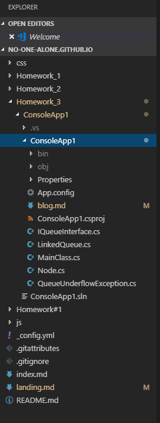
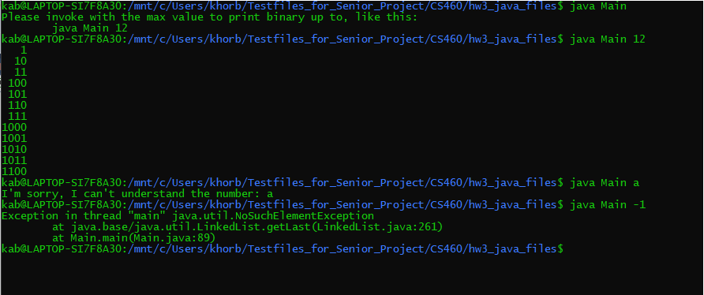
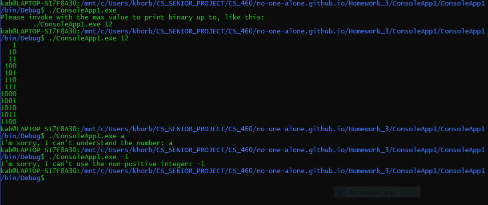

## Homework 3

Regarding the third homework, we had to learn how to install and use the Visual Studio IDE, learn the C# language, and rewrite an instructor-provided java program such that it matched the original as closely as possible but with C# instead of java while having the same program behavior and output results. We also learned to use XML comments due to their utility in the Visual Studio environment along with implementing a .gitignore file to avoid having to add a large number of unnecessary files to our git repositories.


### Homework 3 Links
1. [Home page](https://no-one-alone.github.io/)
2. [Assignment Page](http://www.wou.edu/~morses/classes/cs46x/assignments/HW3_1819.html)
3. [Code Repository](https://github.com/No-one-alone/no-one-alone.github.io)
4. [Final Video Demo](https://www.youtube.com/watch?v=F9BMpgQGSkw)


### Part 1: The Phantom Git

No new commands were learned this week; however, we did have to learn as part of using the Visual Studio IDE to add a file called the following to the root of our git repository.

``` 
    .gitignore
```

This was necessary as without this file, we would end up with a large collection of files all demanding to be added to the repository when we issued a "git add ." command as part of the Visual Studio console app creation. The file itself was generated automatically but not quite painlessly using Visual Studio automatic features when creating a new project file.

### Part 2: Visual Studio IDE

I downloaded the Visual Studio program from [here](https://visualstudio.microsoft.com/vs/)

### Part 3: Translating a Java binary number generator program into an equivalent C# program and notes on important language features.

As per the assignment directions, I downloaded the "javacode2.zip" file from the homework#3 assignment page which contained the following five files which made up the java program.

```
Node.java
QueueInterface.java
QueueUnderflowException.java 
LinkedQueue.java 
Main.java
```

The program served and behaved as a binary number list generator with the number of entries determined by a user supplied number (see bottom of webpage for program output and behavior) via the following command:

```
java Main 12
```

We were advised to recode or implement these classes into C# versions and the appropriate dialect of "C-sharpese" in this order:

```
1. Node.java ⟶ Node.cs
2. QueueInterface.java ⟶ ?.cs
3. QueueUnderflowException.java ⟶ QueueUnderflowException.cs
4. LinkedQueue.java ⟶ LinkedQueue.cs
5. Main.java ⟶ ?.cs
```
The file names with question marks indicate where the file name for the C# version had to be different from the original java file name due to C# language requirements.

Ultimately, I ended up with these five files at the end.

```
Node.cs
IQueueInterface.cs
QueueUnderflowException.cs
LinkedQueue.cs
MainClass.cs
```


### Part 3.1: Translating Node.java ⟶ Node.cs

The translation of the Node class was straightforward as well as the implementing of the C# feature known as properties. Starting with the original java here


```java

/** Singly linked node class. */

public class Node<T>
{
	public T data;
	public Node<T> next;
	
	public Node( T data, Node<T> next )
	{
		this.data = data;
		this.next = next;
	}
}

```

We ended up with the following.

```csharp

/// <summary>
/// This namespace holds the C# equivalent of the Node.java program code and structure.
/// </summary>
namespace ConsoleApp1
{
    /// <summary>
    /// This is a singly linked node class.
    /// </summary>
    public class Node<T>
    {
        /// <summary>
        /// This is an automatic property to get and set the data contents of this node.
        /// </summary>
        public T Data { get; set; }

        /// <summary>
        /// This is an automatic property to get and set the Next property of Node that is being placed into the queue.
        /// </summary>
        public Node<T> Next { get; set; }

        /// <summary>
        /// This is a non-default constructor to create a new Node to be added to the queue and to specify its content.
        /// </summary>
        /// <param name="data">This is the data the node is to contain.</param>
        /// <param name="next">This is a pointer to the next node to be placed into the queue.</param>
        public Node(T data, Node<T> next)
        {
            this.Data = data;
            this.Next = next;
        }
    }
}

```
Note that the C# language requires classes to be enclosed within organizing namespaces such as the "ConsoleApp1" for our project seen here.
 
Regarding the properties, the javacode had some standard fields as seen here.

```java
	public T data;
	public Node<T> next;
```
These were rewritten as automatic properties seen here.

```csharp
     /// <summary>
     /// This is an automatic property to get and set the data contents of this node.
     /// </summary>
     public T Data { get; set; }

     /// <summary>
     /// This is an automatic property to get and set the Next property of Node that is being placed into the queue.
     /// </summary>
     public Node<T> Next { get; set; }
```
Such properties allow for the easy setting and getting of field values.


### Part 3.2: Translating QueueInterface.java ⟶ IQueueInterface.cs

Our second translation of the QueueInterface file required more use of the Visual Studio IntelliSense and code completion features. The original code was as follows

```java

/**
 * A FIFO queue interface.  This ADT is suitable for a singly
 * linked queue.
 */
public interface QueueInterface<T>
{
    /**
     * Add an element to the rear of the queue
     * 
     * @return the element that was enqueued
     */
    T push(T element);

    /**
     * Remove and return the front element.
     * 
     * @throws Thrown if the queue is empty
     */
    T pop() throws QueueUnderflowException;

    /**
     * Test if the queue is empty
     * 
     * @return true if the queue is empty; otherwise false
     */
    boolean isEmpty();
}

```

And was transformed into

```csharp

/// <summary>
/// This namespace holds the C# equivalent of the QueueInterface.java program code and structure.
/// </summary>
namespace ConsoleApp1
{
    /// <summary>
    /// This is a FIFO queue interface. 
    /// This ADT is suitable for a singly linked queue.
    /// </summary>
    /// <typeparam name="T">T for Generic Type Parameter</typeparam>
    public interface IQueueInterface<T>
    {
        /// <summary>
        /// This adds an element to the rear of the queue.
        /// </summary>
        /// <param name="element">A node element</param>
        /// <returns>The element that was enqueued</returns>
        T Push(T element);

        /// <summary>
        /// Remove and return the front element.
        /// </summary>
        /// <returns>The element that was removed.</returns>
        T Pop();

        /// <summary>
        /// This tests if the queue is empty
        /// </summary>
        /// <returns> true if the queue is empty; otherwise returns false </returns>
        bool IsEmpty();
    }
}

```
Notice that the name of the interface was changed to start with a capital "I". This change was suggested by the Visual Studio program itself and reflects C# convention regarding the naming of interfaces as can be read [here](https://docs.microsoft.com/en-us/dotnet/csharp/programming-guide/interfaces/).

Otherwise, the main changes involved the type name change from "boolean" to "bool" as found in C# and removal of the "throws QueueUnderflowException" component as C# does not support the feature in the same manner as Java.


### Part 3.3: QueueUnderflowException.java ⟶ QueueUnderflowException.cs

Likewise, the java file for QueueUnderflowException seen here

```java

/**
 * A custom unchecked exception to represent situations where 
 * an illegal operation was performed on an empty queue.
 */
public class QueueUnderflowException extends RuntimeException
{
  public QueueUnderflowException()
  {
    super();
  }

  public QueueUnderflowException(String message)
  {
    super(message);
  }
}


```


became this


```csharp

using System;

/// <summary>
/// This namespace holds the C# equivalent of the QueueUnderflowException.java program code and structure.
/// </summary>
namespace ConsoleApp1
{
    /// <summary>
    /// This is a custom unchecked exception to represent situations where 
    /// an illegal operation was performed on an empty queue.
    /// </summary>
    public class QueueUnderflowException : Exception
    {
        /// <summary>
        /// This the constructor for handling thrown exceptions.
        /// </summary>
        public QueueUnderflowException()
        {
        }

        /// <summary>
        /// This is the non-default constructor for handling thrown exceptions.
        /// </summary>
        /// <param name="message">An error message to the user</param>
        public QueueUnderflowException(string message) : base(message)
        {
        }
    }
}

```
Here, I found that "RuntimeException" was not supported in C# and had to use "Exception" instead with the C# form of declaration involving the syntax ":" instead of the keyword "extends" which is also not supported in C#.
In addition, note the use of the same ":" syntax to declare the use of the "base(message)" for storing thrown exception messages.
Lastly, I had to add the import "using System;" to provide proper support for the above features.

### Part 3.4: LinkedQueue.java ⟶ LinkedQueue.cs

Yet, again we have the java version of the LinkedQueue file here

```java

/**
 * A Singly Linked FIFO Queue.  
 * From Dale, Joyce and Weems "Object-Oriented Data Structures Using Java"
 * Modified for CS 460 HW3
 * 
 * See QueueInterface.java for documentation
 */

public class LinkedQueue<T> implements QueueInterface<T>
{
	private Node<T> front;
	private Node<T> rear;

	public LinkedQueue()
	{
		front = null;
		rear = null;
	}

	public T push(T element)
	{ 
		if( element == null )
		{
			throw new NullPointerException();
		}
		
		if( isEmpty() )
		{
			Node<T> tmp = new Node<T>( element, null );
			rear = front = tmp;
		}
		else
		{		
			/* General case */
			Node<T> tmp = new Node<T>( element, null );
			rear.next = tmp;
			rear = tmp;
        }
        return element;
	}     

	public T pop()
	{
		T tmp = null;
		if( isEmpty() )
		{
			throw new QueueUnderflowException("The queue was empty when pop was invoked.");
		}
		else if( front == rear )
		{	/* one item in queue */
			tmp = front.data;
			front = null;
			rear = null;
		}
		else
		{
			/* General case */
			tmp = front.data;
			front = front.next;
		}
		
		return tmp;
	}

	public boolean isEmpty()
	{              
		if( front == null && rear == null )
		{
			return true;
		}
		else
		{
			return false;
		}
	}

}

```

which became

```csharp

using System;

/// <summary>
/// This namespace holds the C# equivalent of the LinkedQueue.java program code and structure.
/// </summary>
namespace ConsoleApp1
{
    /// <summary>
    /// A Singly Linked FIFO Queue.  
    /// From Dale, Joyce and Weems "Object-Oriented Data Structures Using Java"
    /// Modified for CS 460 HW3
    /// Subsequently translated into C# equivalent file by Khorben Boyer.
    /// See QueueInterface.java for documentation
    /// </summary>
    /// <typeparam name="T">T for Generic Type Parameter</typeparam>
    public class LinkedQueue<T> : IQueueInterface<T>
    {
        /// <summary>
        /// This is an automatic property to get and set the Front property of Node that is being placed into the queue.
        /// </summary>
        public Node<T> Front { get; set; }

        /// <summary>
        /// This is an automatic property to get and set the Rear property of Node that is being placed into the queue.
        /// </summary>
        public Node<T> Rear { get; set; }

        /// <summary>
        /// This the constructor for initializing the Front and Rear properties to null
        /// </summary>
        public LinkedQueue()
        {
            Front = null;
            Rear = null;
        }

        /// <summary>
        /// This method pushes a node element onto the queue
        /// </summary>
        /// <param name="element">This is a node element</param>
        /// <returns>The node element</returns>
        public T Push(T element)
        {
           if(element == null)  // This checks if the element is null and throws an exception if it is.
            {
                throw new ArgumentNullException();
           }
           if(IsEmpty()) // This checks if the queue is empty and pushes the node into the empty queue.
            {
                Node<T> tmp = new Node<T>(element, null);
                Rear = Front = tmp;
           }
           else // if not empty -(General Case), then it adds the node to the rear of the queue and advances the queue order.
           {
                Node<T> tmp = new Node<T>(element, null);
                Rear.Next = tmp;
                Rear = tmp;
           }
           return element;
        }


        /// <summary>
        /// This method pops a node element off the queue
        /// </summary>
        /// <returns>A node element</returns>
        public T Pop()
        {
            T tmp = default(T);  // default is C# equivalent to "null" in java.

            
            if (IsEmpty()) // This checks if the queue is empty and throws an exception if it is; otherwise it gets a node appropriately.
            {
                throw new QueueUnderflowException("The queue was empty when pop was invoked.");
            }
            else if(Front == Rear) // This is for the case of there being one item in the queue.
            {
                tmp = Front.Data;
                Front = null;
                Rear = null;
            }
            else // This covers the general case of there being more than one item in the queue.
            {
                tmp = Front.Data;
                Front = Front.Next;
            }

            return tmp;
        }

        /// <summary>
        /// This checks if the queue is empty.
        /// </summary>
        /// <returns>It returns true if queue is empty; false otherwise</returns>
        public bool IsEmpty()
        {
            if( Front == null && Rear == null) // this checks if queue is empty
            {
                return true;
            }
            else // this covers the general case of the queue not being empty.
            {
                return false;
            }
        }
    }
}

```

Beyond the differences already discussed in the previous file translations, we see how "default(T)" had to be used in place of "null"  for "T tmp" and how "NullPointerException()" was replaced with "ArgumentNullException()" as per C# language requirements.

### Part 3.5: Main.java ⟶ MainClass.cs

Finally, we have the Main java file

```java

/**
 * Original by Sumit Ghosh "An Interesting Method to Generate Binary Numbers from 1 to n"
 * at https://www.geeksforgeeks.org/interesting-method-generate-binary-numbers-1-n/
 * 
 * Adapted for CS 460 HW3.  This simple example demonstrates the rather powerful
 * application of Breadth-First Search to enumeration of states problems.
 * 
 * There are easier ways to generate a list of binary values, but this technique
 * is very general and a good one to remember for other uses.
 */

import java.util.LinkedList; 

public class Main  
{ 
    /**
     * Print the binary representation of all numbers from 1 up to n.
     * This is accomplished by using a FIFO queue to perform a level 
     * order (i.e. BFS) traversal of a virtual binary tree that 
     * looks like this:
     *                 1
     *             /       \
     *            10       11
     *           /  \     /  \
     *         100  101  110  111
     *          etc.
     * and then storing each "value" in a list as it is "visited".
     */
    static LinkedList<String> generateBinaryRepresentationList(int n) 
    { 
        /* Create an empty queue of strings with which to perform the traversal */
        LinkedQueue<StringBuilder> q = new LinkedQueue<StringBuilder>(); 

        /* A list for returning the binary values */
        LinkedList<String> output = new LinkedList<String>();
        
        if(n < 1)
        {
            /* binary representation of negative values is not supported
             return an empty list */
            return output;
        }
          
        /* Enqueue the first binary number.  Use a dynamic string to avoid string concat */
        q.push(new StringBuilder("1")); 
          
        /* BFS */
        while(n-- > 0) 
        { 
            /* print the front of queue */
            StringBuilder sb = q.pop(); 
            output.add(sb.toString()); 
            
            /* Make a copy */
            StringBuilder sbc = new StringBuilder(sb.toString());

            /* Left child */
            sb.append('0');
            q.push(sb);
            /* Right child */
            sbc.append('1');
            q.push(sbc); 
        }
        return output;
    } 
      
    /* Driver program to test above function */
    public static void main(String[] args)  
    { 
        int n = 10;
        if(args.length < 1)
        {
            System.out.println("Please invoke with the max value to print binary up to, like this:");
            System.out.println("\tjava Main 12");
            return;
        }
        try 
        {
            n = Integer.parseInt(args[0]);
        } 
        catch (NumberFormatException e) 
        {
            System.out.println("I'm sorry, I can't understand the number: " + args[0]);
            return;
        }
        LinkedList<String> output = generateBinaryRepresentationList(n);
        /* Print it right justified.  Longest string is the last one.
         Print enough spaces to move it over the correct distance */
        int maxLength = output.getLast().length();
        for(String s : output)
        {
            for(int i = 0; i < maxLength - s.length(); ++i)
            {
                System.out.print(" ");
            }
            System.out.println(s);
        }
    } 
} 

```

which in turn became

```csharp

using System;
using System.Collections.Generic;
using System.Text;

/// <summary>
/// This namespace holds the C# equivalent of the Main.java program code and structure.
/// </summary>
namespace ConsoleApp1
{

    /// <summary>
    ///  Original by Sumit Ghosh "An Interesting Method to Generate Binary Numbers from 1 to n"/// 
    ///  at https://www.geeksforgeeks.org/interesting-method-generate-binary-numbers-1-n/
    ///
    /// Adapted for CS 460 HW3.This simple example demonstrates the rather powerful
    /// application of Breadth-First Search to enumeration of states problems.
    /// 
    /// There are easier ways to generate a list of binary values, but this technique
    /// is very general and a good one to remember for other uses.
    /// 
    /// Subsequently translated into C# equivalent file by Khorben Boyer.
    /// </summary>
    public class MainClass
    {
        /// <summary>
        /// Print the binary representation of all numbers from 1 up to n.
        /// This is accomplished by using a FIFO queue to perform a level
        /// order(i.e.BFS) traversal of a virtual binary tree that
        /// looks like this:
        ///                1
        ///             /       \
        ///           10       11
        ///          /  \     /  \
        ///        100  101  110  111
        ///         etc.
        /// and then storing each "value" in a list as it is "visited".
        /// </summary>
        /// <param name="n">integer called n</param>
        /// <returns>A linked list</returns>
        static LinkedList<string> GenerateBinaryRepresentationList(int n)
        {
            LinkedQueue<StringBuilder> q = new LinkedQueue<StringBuilder>(); //Create an empty queue of strings with which to perform the traversal.

            LinkedList<string> output = new LinkedList<string>(); // A list for returning the binary values.

            if ( n < 1)
            {
                return output;     // binary representation of negative values is not supported; return an empty list.
            }

            q.Push(new StringBuilder("1")); // Enqueue the first binary number.  Use a dynamic string to avoid string concat

            // BFS
            while (n-- > 0)
            {
                // print the front of queue
                StringBuilder sb = q.Pop();
                output.AddLast(sb.ToString());

                //  Make a copy
                StringBuilder sbc = new StringBuilder(sb.ToString());

                // Left child
                sb.Append('0');
                q.Push(sb);

                // Right child
                sbc.Append('1');
                q.Push(sbc);

            }
            return output;
        }

        /// <summary>
        /// Driver program to test above function and main program entry point.
        /// </summary>
        /// <param name="args">Takes command line arguments</param>
        public static void Main(string[] args)
        {
            int n = 10; // initializes variable.

            if(args.Length < 1) // checks if user supplied a command line argument.
            {
                // informative program use message for user.
                Console.WriteLine("Please invoke with the max value to print binary up to, like this:");
                Console.WriteLine("\t./ConsoleApp1.exe 12");

                return;
            }

            try // checks if an exception is thrown due to invalid user input.
            {
               // int.TryParse(args[0], out n);
               n = int.Parse(args[0]);
            }
     
            catch (FormatException e) // catches format type exception.
            {
                // informative error message for user.
                Console.WriteLine("I'm sorry, I can't understand the number: " + args[0]);
                return;
            }

            LinkedList<String> output = GenerateBinaryRepresentationList(n); // Calls function to make linked list with node values.
            
            int maxLength; // initializes variable.

            try // checks if list empty due to invalid numerical input from user.
            {
                maxLength = output.Last.Value.Length; // gets the length of the string value of the last node in the list.
            }
            catch(NullReferenceException) // Catches Null reference generated by an empty list.
            {
                // informative error message for user.
                Console.WriteLine("I'm sorry, I can't use the non-positive integer: " + args[0]);
                return;
            }

            // Print it right justified.  Longest string is the last one.
            // Print enough spaces to move it over the correct distance
            foreach (string item in output)
            {
                for(int i = 0; i < maxLength - item.Length; ++i)
                {
                    Console.Write(" ");
                }

                Console.WriteLine(item);
            }
        }
    }
}


```
Again excepting the differences already discussed, it is very similar to java. Differences include that some of the methods have to be capitalized such as ".Append()" instead of having ".append()" along with some more significant changes. Namely, instead of "System.out.print()" and "System.out.println()", one has to use "Console.Write()" and "Console.Writeline()" to obtain the same behavior, "Integer.parseInt(args[0])" became the rather similar "int.Parse(args[0])", "output.getLast().length()" was instead the slightly longer "output.Last.Value.Length", "Main" had to become "MainClass" to avoid conflict with the "main method" program entry point, and the for loop declaration had "foreach (string item in output)" in place of "for(String s : output)". I had to add the import statement "using System.Collections.Generic" in place of the "import java.util.LinkedList" to support linked list usage and "using System.Text" for character encoding.  Lastly, I added the additional "try/catch" statements around the maxLength retrieval to catch invalid integer input from the user.


### Part 3.6: XML comments

The required XML comments proved easy to implement and use in the C# program. All one had to do in the IDE was simply type
```
  ///
```
above the line of code in question and one would get something like the following

```
  /// <summary>
  /// 
  /// </summary>
  /// <param name="args"></param>
  /// <returns></returns>
```
In particular, the exact HTML elements generated are context sensitive in that what is generated is directly matched with the type and level of code statement e.g. (a method/function -with or without parameter vs. a class vs. an interface vs. a namespace).


### Part 3.7: Final Results

This shows how the overall file structure of my homework #3 project was organized in Visual Studio Code which is a little different compared to the last few homeworks due to the structure and content of a C# console app created via Visual Studio IDE.



Next, we have a picture of the behavior of the original java program.



And a picture of the near identical behavior of the C# program it was translated into.



As we can see, everything works regarding our translated C# program which is identical in behavior and output to the original java program excepting the inclusion of some additional exception handling as seen with the new message for the user

```
I'm sorry, I can't use the non-positive integer: -1
```

In general, this was an interesting experience in becoming aquainted with the Visual Studio IDE and the C# language along with using this knowledge to translate a Java program into an equivalent version wholly written in C# but with effectively identical behavior.
