## Homework 4

For the fourth homework, we had to learn the basics of the ASP.NET MVC 5 platform, along with how to use the HTTP GET and POST requests for webpages of the app that respond to user input with output. This involved using query strings and passing the information using the GET and POST requests. Furthermore, we had to learn about Views and Controllers and the use of the related ViewBag and Request dynamic objects inherent to the Model-View-Controller paradigm. Finally, we learned the basics of applying the language of the Razor HTML helpers as useful constructs to aid our development of the web app.


### Homework 4 Links
1. [Home page](https://no-one-alone.github.io/)
2. [Assignment Page](http://www.wou.edu/~morses/classes/cs46x/assignments/HW4_1819.html)
3. [Code Repository](https://github.com/No-one-alone/no-one-alone.github.io)
4. [Final Video Demo](https://www.youtube.com/watch?v=vVG3dyfr420&feature=youtu.be)

### Part 1: Attack of the Git

As part of the requirements for this lab, two separate feature branches were created for separate development of the Converter and ColorChooser features of the web app.

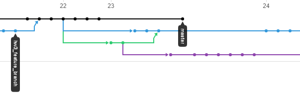

This didn't require any new git commands in itself, but the merge process was a bit more involved compared to previous homeworks and did require some new commands to resolve some unexpected errors and situations that arose.

Note the state of the branches before any of the merges.


First, as per a proper merge protocol, the master branch was first merged into the hw4_mile_converter branch.

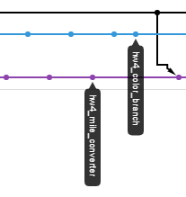

After dealing with any resultant merge conflicts with appropriate code edits along with adding and committing, the hw4_mile_converter branch was then merged into the master branch. Unfortunately, this resulted in a "Fast-forward" merge where instead of maintaining branches as separate via creation of a new commit object, a single branch with all commits was instead produced with master which does not allow us to maintain a history of the feature branch unlike in the non fast-forward merge. The difference between these types of merges can be seen this diagram.

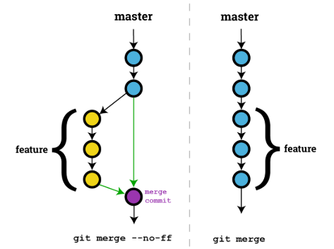

After doing some googling, I settled on using the following command to undo the second merge.

```bash
git reset --hard HEAD@{#id of where HEAD used to point pre-merge}
```

Note that the #id was found using this command.

```bash

git reflog
```

In turn, this took me to exactly the last commit on master before the second merge had occurred.

The second merge was then re-attempted on master using the altered merge command seen here.

```bash
git merge --no-ff hw4_mile_converter -m "message"
```

This prevented the same situation from developing and gave us the kind of merge seen in previous homeworks. As to why this occurred in the first place with the second merge, the reason follows from the fact that since master had already been merged into the hw4_mile_converter branch to begin with, the merge opeation proceeded to treat them as all part of the same branch due to the resultant similarity.

Now back on track with one feature branch fully merged into master as seen here.

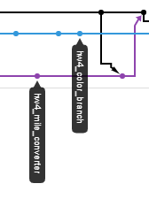

We then proceeded to do the same operation with the second feature branch, hw4_color_branch, in terms of first merging master into the branch, resolving the merge conflicts one by one, along with adding and commiting them.

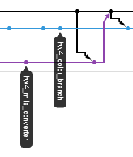

Next, we completed the last merge of the second feature branch into master via the same non fast-forwad merge command while on master.

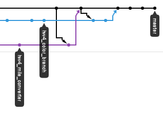

As this process was unfolding, the following command was used to allow us to look at the resultant graph of branches and merges without having to push the local repo to the remote to see the network on Git Hub.

```bash
git log --oneline --graph
```
The resultant graph.

```bash
khorb@LAPTOP-SI7F8A30 MINGW64 ~/CS_SENIOR_PROJECT/CS_460/no-one-alone.github.io (master)
$ git log --oneline --graph
*   3b58487 (HEAD -> master) merged hw4_color_branch into master.
|\
| * 33d833f (hw4_color_branch) fixed order of navbar options, Converter and ColorChooser, to match homework#4 spec.
| *   64366fb resolved merge conflicts of merging master into hw4_color_branch
| |\
| |/
|/|
* |   c20c64b merged hw4_mile_converter branch into master branch
|\ \
| * \   b4adc66 (hw4_mile_converter) merged master into hw4_mile_converter branch and fixed merge conflicts
| |\ \
| |/ /
|/| |
* | | f36ab99 (origin/master, origin/HEAD) edited README.md file to advance master before merge of hw4 feature branches
* | | ed2e32f edited README.md file to advance master
* | | 5a5f130 made a mistake. deleting homework_4 again
* | | 749852c created homework_4 folder and added correct version of mvc web application with visual studio
* | | 2d69795 git deleted old version of homework#4
| * | 474fd2a (origin/hw4_mile_converter) added appropriate C# XML and Razor/HTML comments to the HomeController.cs, Converter.

```
As can be seen, this matched what was seen in the pictures above of the network on Git Hub after all merges had been completed and pushed to the remote.

Thus, the mile converter and color chooser features were developed on separate branches which were all successfully merged back into master. We will see how each feature looked when displayed pre-merge in the last section of the blog along with the completed web page.


### Part 2: Visual Studio IDE

I downloaded the Visual Studio program from [here](https://visualstudio.microsoft.com/vs/)

### Part 3: Translating a Java binary number generator program into an equivalent C# program and notes on important language features.

As per the assignment directions, I downloaded the "javacode2.zip" file from the homework#3 assignment page which contained the following five files which made up the java program.

```
Node.java
QueueInterface.java
QueueUnderflowException.java 
LinkedQueue.java 
Main.java
```

The program served and behaved as a binary number list generator with the number of entries determined by a user supplied number (see bottom of webpage for program output and behavior) via the following command:

```
java Main 12
```

We were advised to recode or implement these classes into C# versions and the appropriate dialect of "C-sharpese" in this order:

```
1. Node.java ⟶ Node.cs
2. QueueInterface.java ⟶ ?.cs
3. QueueUnderflowException.java ⟶ QueueUnderflowException.cs
4. LinkedQueue.java ⟶ LinkedQueue.cs
5. Main.java ⟶ ?.cs
```
The file names with question marks indicate where the file name for the C# version had to be different from the original java file name due to C# language requirements.

Ultimately, I ended up with these five files at the end.

```
Node.cs
IQueueInterface.cs
QueueUnderflowException.cs
LinkedQueue.cs
MainClass.cs
```


### Part 3.1: Translating Node.java ⟶ Node.cs


### Part 3.2: Translating QueueInterface.java ⟶ IQueueInterface.cs


### Part 3.3: QueueUnderflowException.java ⟶ QueueUnderflowException.cs


### Part 3.4: LinkedQueue.java ⟶ LinkedQueue.cs

```csharp

```

### Part 3.5: Main.java ⟶ MainClass.cs


### Part 3.6: XML comments

The required XML comments proved easy to implement and use in the C# program. All one had to do in the IDE was simply type
```
  ///
```
above the line of code in question and one would get something like the following

```
  /// <summary>
  /// 
  /// </summary>
  /// <param name="args"></param>
  /// <returns></returns>
```
In particular, the exact HTML elements generated are context sensitive in that what is generated is directly matched with the type and level of code statement e.g. (a method/function -with or without parameter vs. a class vs. an interface vs. a namespace).


### Part 3.7: Final Results


This shows how the overall file structure of my homework #4 project was organized in Visual Studio Code which is a quite a bit different compared to the last few homeworks due to the structure and content of an ASP.NET MVC 5 web application created via the Visual Studio IDE.

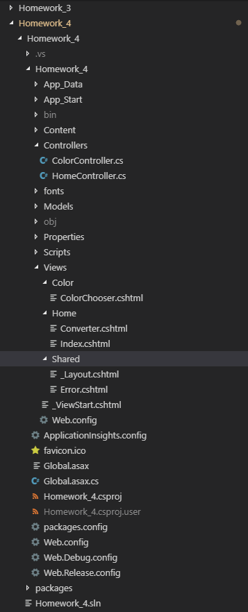

Next, we have a picture of the mile converter feature pre-merge on the landing page.

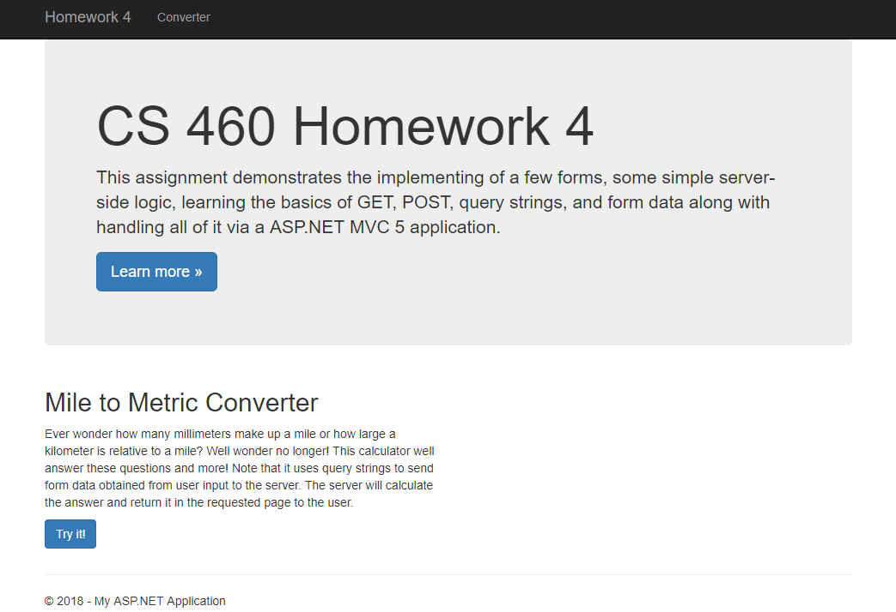

And a picture of the the color chooser feature pre-merge on the landing page.

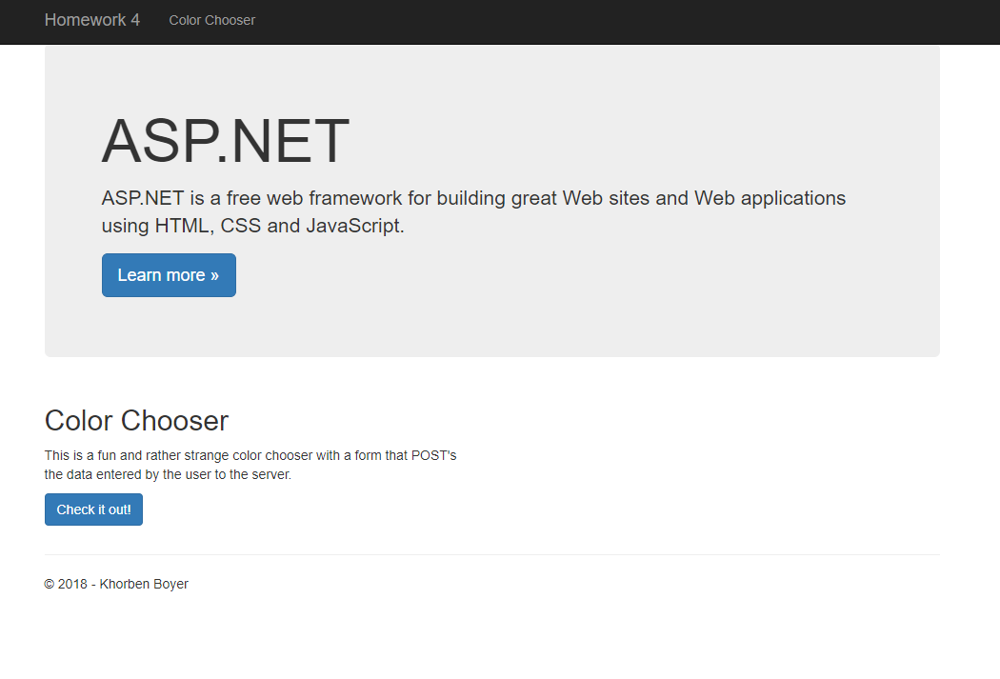

And finally a picture of the fully merged and completed web app landing page.

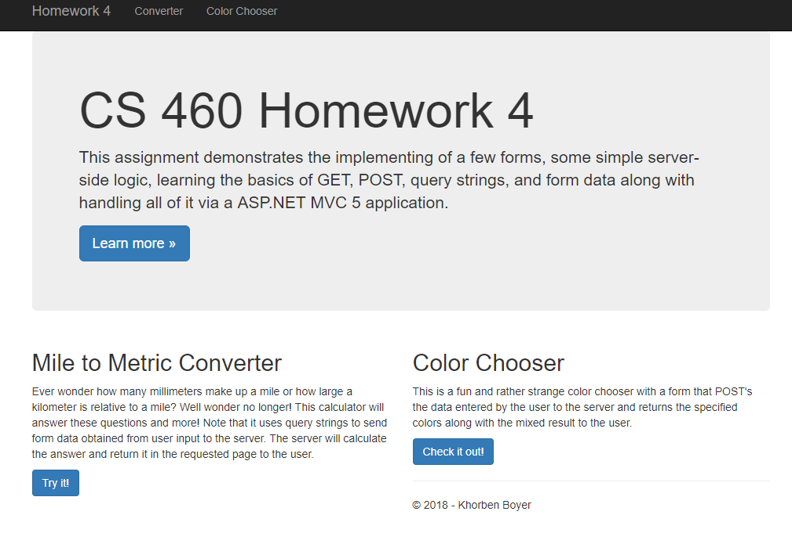

Furthermore, the converter feature can be seen here.

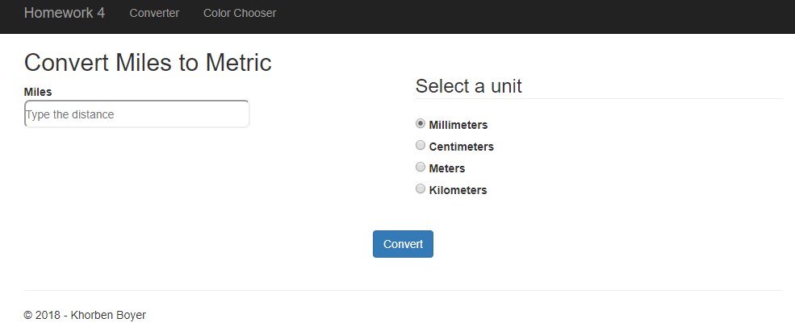

And its operation with the use of a GET request and query string as well.

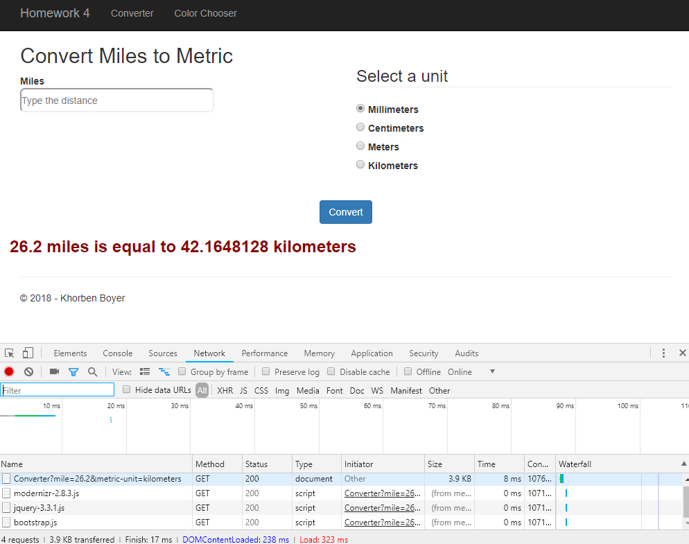

Also, the color chooser feature can be observed below.

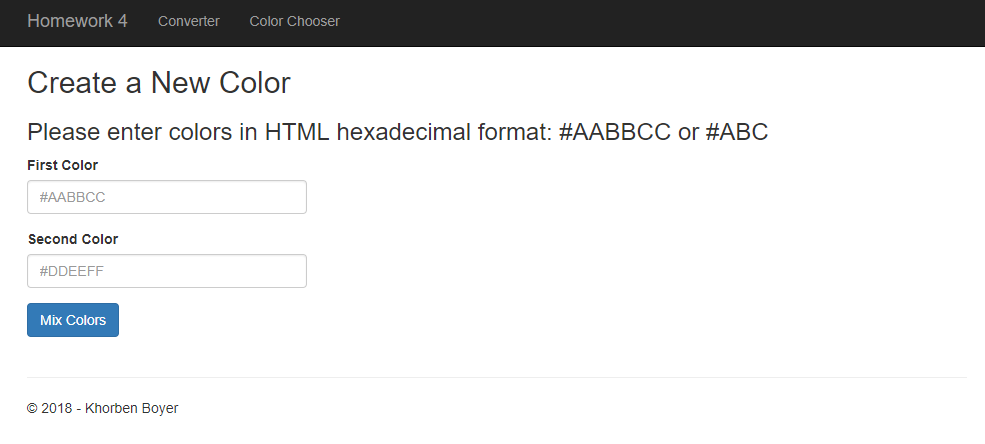

Along with its operation with the use of a POST request.

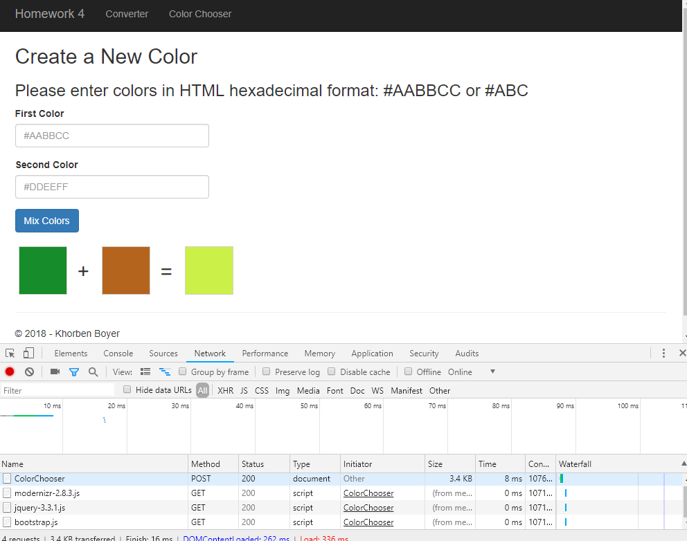

As we can see, everything has been implemented regarding our ASP.NET MVC 5 web application and can be seen to work both according to the above screenshots and the video demo in the link at the top.

Overall, this was a trying but useful experience in becoming aquainted with creating and utilizing the ASP.NET MVC 5 platform for creating web applications under the Model-View-Controller paradigm with the GET and POST server requests for handling data.