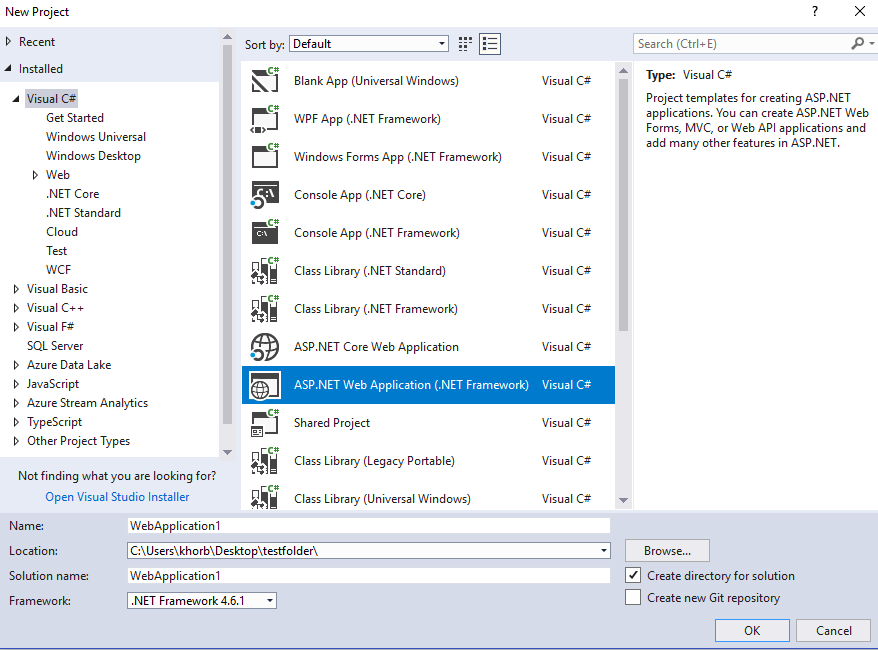
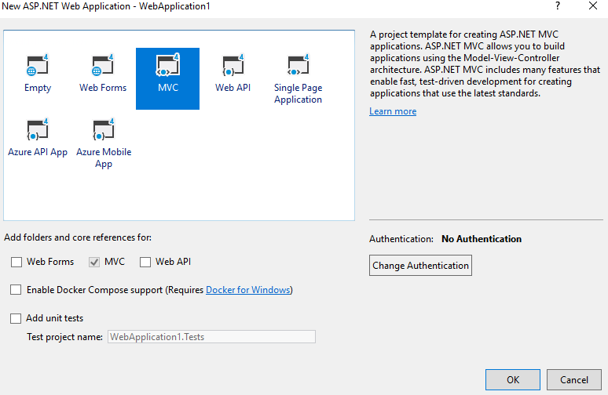
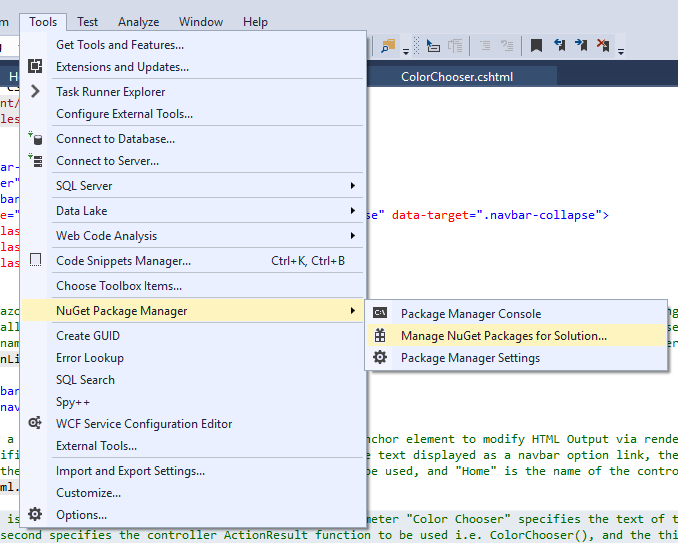
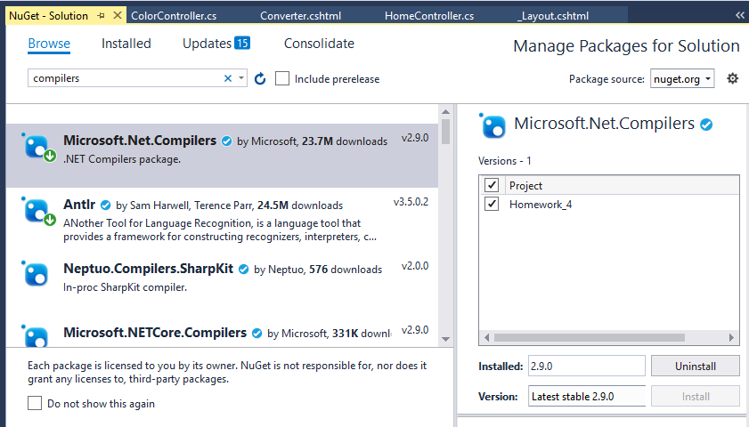
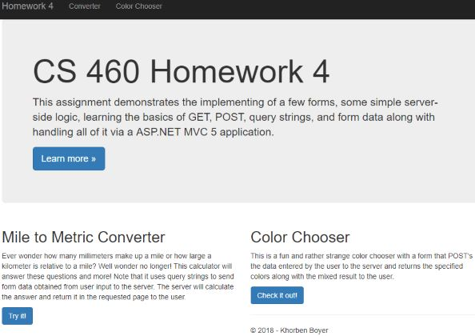

## Homework 4

For the fourth homework, we had to learn the basics of the ASP.NET MVC 5 platform, along with how to use the HTTP GET and POST requests for webpages of the app that respond to user input with output. This involved using query strings and passing the information using the GET and POST requests. Furthermore, we had to learn about Views and Controllers and the use of the related ViewBag and Request dynamic objects inherent to the Model-View-Controller paradigm. Finally, we learned the basics of applying the language of the Razor HTML helpers as useful constructs to aid our development of the web app.


### Homework 4 Links
1. [Home page](https://no-one-alone.github.io/)
2. [Assignment Page](http://www.wou.edu/~morses/classes/cs46x/assignments/HW4_1819.html)
3. [Code Repository](https://github.com/No-one-alone/no-one-alone.github.io)
4. [Final Video Demo](https://www.youtube.com/watch?v=vVG3dyfr420&feature=youtu.be)

### Part 1: Attack of the Git

As part of the requirements for this lab, two separate feature branches were created for separate development of the Converter and ColorChooser features of the web app.


This didn't require any new git commands in itself, but the merge process was a bit more involved compared to previous homeworks and did require some new commands to resolve some unexpected errors and situations that arose.

Note the state of the branches before any of the merges.


First, as per a proper merge protocol, the master branch was first merged into the hw4_mile_converter branch.


After dealing with any resultant merge conflicts with appropriate code edits along with adding and committing, the hw4_mile_converter branch was then merged into the master branch. Unfortunately, this resulted in a "Fast-forward" merge where instead of maintaining branches as separate via creation of a new commit object, a single branch with all commits was instead produced with master which does not allow us to maintain a history of the feature branch unlike in the non fast-forward merge. The difference between these types of merges can be seen in this diagram.


After doing some googling, I settled on using the following command to undo the second merge.

```bash
git reset --hard HEAD@{#id of where HEAD used to point pre-merge}
```

Note that the #id was found using this command.

```bash

git reflog
```

In turn, this took me to exactly the last commit on master before the second merge had occurred.

The second merge was then re-attempted on master using the altered merge command seen here.

```bash
git merge --no-ff hw4_mile_converter -m "message"
```

This prevented the same situation from developing and gave us the kind of merge seen in previous homeworks. As to why this occurred in the first place with the second merge, the reason follows from the fact that since master had already been merged into the hw4_mile_converter branch to begin with, the merge operation proceeded to treat them as all part of the same branch due to the resultant similarity.

Now back on track with one feature branch fully merged into master as seen here.


We then proceeded to do the same operation with the second feature branch, hw4_color_branch, in terms of first merging master into the branch, resolving the merge conflicts one by one, and adding along with commiting them.


Next, we completed the last merge of the second feature branch into master via the same non fast-forward merge command while on master.


As this process was unfolding, the following command was used to allow us to look at the resultant graph of branches and merges without having to push the local repo to the remote to see the network on Git Hub.

```bash
git log --oneline --graph
```
The resultant graph.

```bash
khorb@LAPTOP-SI7F8A30 MINGW64 ~/CS_SENIOR_PROJECT/CS_460/no-one-alone.github.io (master)
$ git log --oneline --graph
*   3b58487 (HEAD -> master) merged hw4_color_branch into master.
|\
| * 33d833f (hw4_color_branch) fixed order of navbar options, Converter and ColorChooser, to match homework#4 spec.
| *   64366fb resolved merge conflicts of merging master into hw4_color_branch
| |\
| |/
|/|
* |   c20c64b merged hw4_mile_converter branch into master branch
|\ \
| * \   b4adc66 (hw4_mile_converter) merged master into hw4_mile_converter branch and fixed merge conflicts
| |\ \
| |/ /
|/| |
* | | f36ab99 (origin/master, origin/HEAD) edited README.md file to advance master before merge of hw4 feature branches
* | | ed2e32f edited README.md file to advance master
* | | 5a5f130 made a mistake. deleting homework_4 again
* | | 749852c created homework_4 folder and added correct version of mvc web application with visual studio
* | | 2d69795 git deleted old version of homework#4
| * | 474fd2a (origin/hw4_mile_converter) added appropriate C# XML and Razor/HTML comments to the HomeController.cs, Converter.

```
As can be seen, this matched what was seen in the pictures above of the network on Git Hub after all merges had been completed and pushed to the remote.

Thus, the mile converter and color chooser features were developed on separate branches which were all successfully merged back into master. We will see how each feature looked when displayed pre-merge in the last section of the blog along with the completed web page.


### Part 2: Creation of ASP.NET MVC 5 web app with Visual Studio IDE

To create the new project, I selected ASP.NET Web Application with the .Net Framework as seen here.



Followed by choosing the MVC project template seen below.



Visual Studio then automatically set everything up in the project including the preexisting landing page seen here for us to work with which was repurposed with our features as seen below in the "Final Results" section of this blog.


One issue that arose after Homework #4 had been effectively finished involved a final validation of the project via cloning to a different non-git initialized directory which resulted in failure after rebuilding the project and starting up the web app.

This problem was solved by the using the NuGet Package Manager seen accessed here.



And then browsing for compilers followed by selecting and installing the Microsoft.Net.Compilers package seen below.



### Part 3: Editing the MVC 5 project and adding features.

At the conclusion of this project, we had these edited or added files.

```
_Layout.cshtml
Index.cshtml
Converter.cshtml
ColorChooser.cshtml
HomeController.cs
ColorController.cs

```

We will proceed to cover the use of these files in the project.

### Part 3.1: Landing page ⟶ _Layout.cshtml component

This file was already present from the project setup and had only a few key changes and additions made to it.

```html

<!DOCTYPE html>
<html>
<head>
    <meta charset="utf-8" />
    <meta name="viewport" content="width=device-width, initial-scale=1.0">
    <title>@ViewBag.Title - CS 460 Homework #4</title>
    @Styles.Render("~/Content/css")
    @Scripts.Render("~/bundles/modernizr")
</head>
<body>
    <div class="navbar navbar-inverse navbar-fixed-top">
        <div class="container">
            <div class="navbar-header">
                <button type="button" class="navbar-toggle" data-toggle="collapse" data-target=".navbar-collapse">
                    <span class="icon-bar"></span>
                    <span class="icon-bar"></span>
                    <span class="icon-bar"></span>
                </button>

                @* This a Razor language Hmtl.ActionLink which returns an anchor element to modify HTML Output via rendering an HTML link.
                Specifically, the first parameter "Homework 4" will be the text displayed as a navbar option link, the second parameter "Index" 
                is the name of the controller ActionResult function to be used, and "Home" is the name of the controller file to be used*@
                @Html.ActionLink("Homework 4", "Index", "Home", new { area = "" }, new { @class = "navbar-brand" })
            </div>
            <div class="navbar-collapse collapse">
                <ul class="nav navbar-nav">

                    @* This a Razor language Hmtl.ActionLink which returns an anchor element to modify HTML Output via rendering an HTML link
                       Specifically, the first parameter "Converter" will be the text displayed as a navbar option link, the second parameter "Converter"
                        is the name of the controller ActionResult function to be used, and "Home" is the name of the controller file to be used for the mile converter*@
                    <li>@Html.ActionLink("Converter", "Converter", "Home")</li>

                    @* This is a Razor language Html.ActionLink. The first parameter "Color Chooser" specifies the text of the navbar option link,
                       the second specifies the controller ActionResult function to be used i.e. ColorChooser(), and the third, the name of the controller file to be used for the color chooser *@
                    <li>@Html.ActionLink("Color Chooser", "ColorChooser", "Color")</li>

                </ul>
            </div>
        </div>
    </div>
    <div class="container body-content">
        @RenderBody()
        <hr />
        <footer>
            @*This was changed to have my name*@
            <p>&copy; @DateTime.Now.Year - Khorben Boyer</p>
        </footer>
    </div>

    @Scripts.Render("~/bundles/jquery")
    @Scripts.Render("~/bundles/bootstrap")
    @RenderSection("scripts", required: false)
</body>
</html>

```
Specifically, these were changed to have the appropriate title and name respectively.

```html
...
@*Changed title of web page in tab*@
<title>@ViewBag.Title - CS 460 Homework #4</title>
...
 @*This was changed to have my name*@
<p>&copy; @DateTime.Now.Year - Khorben Boyer</p>
...

```
Also, these Razor language HTML ActionLink helpers were added in place of the more usual "href=" html attributes.

```html
...
 @Html.ActionLink("Homework 4", "Index", "Home", new { area = "" }, new { @class = "navbar-brand" })
....
 @Html.ActionLink("Converter", "Converter", "Home")
...
@Html.ActionLink("Color Chooser", "ColorChooser", "Color")
...
```
The first parameter of these helpers consists of the text to be displayed for the link, the second parameter specifies the name of a suitable controller ActionResult function, and the third parameter specifies the specific Controller file needed.

### Part 3.2 Landing page ⟶ Index.cshtml

This file was also already present after the initial project setup.

```html

@*This file describes some of the form as well as the text content of the landing page and the page option descriptions.*@

@{
    ViewBag.Title = "Home Page"; // Title of the homepage.
}

@*This contains a basic description of the assignment to be displayed on the introduction component of the web page.*@
<div class="jumbotron">
    <h1>CS 460 Homework 4</h1>
    <p class="lead">
        This assignment demonstrates the implementing of a few forms, some simple server-side logic,
        learning the basics of GET, POST, query strings,
        and form data along with handling all of it via a ASP.NET MVC 5 application.

    </p>
     <p><a href="http://www.wou.edu/~morses/classes/cs46x/assignments/HW4_1819.html" class="btn btn-primary btn-lg">Learn more &raquo;</a></p> 
    
</div>

<div class="row">

    @*This contains a description of what the mile distance converter does and the button that leads to it.*@
    <div class="col-md-6">
        <h2>Mile to Metric Converter</h2>
        <p>
            Ever wonder how many millimeters make up a mile or how large a kilometer is relative to a mile?
            Well wonder no longer! This calculator will answer these questions and more!
            Note that it uses query strings to send form data obtained from user input to the
            server. The server will calculate the answer and return it in the requested page to the user.
        </p>

        @*This specifies the button that links and takes the user to the Converter page via a Razor Html.ActionLink()
           The first parameter gives the name of the button, the second gives the name of a controller ActionResult function,and the third, the name of the controller file for the mile converter.*@
        <p><a class="btn btn-primary" @Html.ActionLink("Try it!", "Converter", "Home")</a></p> 

    </div>

   @* This describes the color chooser option and provides a button that links and takes the user to the feature.*@
    <div class="col-md-6">
        <h2>Color Chooser</h2>
        <p>
            This is a fun and rather strange color chooser with a form that POST's the data entered by the user to the server
            and returns the specified colors along with the mixed result to the user.
        

        </p>

        @* This is the button for the user to click. 
           It is a Razor Html.ActionLink where the first paramenter specifies the text of the button, the second is
            the name of the relevant controller ActionResult function i.e ColorChooser(), and the third is the name of the controller file for the color chooser*@
        <p><a class="btn btn-primary" @Html.ActionLink("Check it out!", "ColorChooser", "Color")</a></p> 
    <div>

</div>

```

Besides the text added, altering the names of titles and buttons, and adding the link to the Homework #4 assignment page, the primary concern here is the addition of the Razor HTML helper action links as part of the HTML submit buttons as required by the assignment.

```html
...
<p><a class="btn btn-primary" @Html.ActionLink("Try it!", "Converter", "Home")</a></p> 
...
<p><a class="btn btn-primary" @Html.ActionLink("Check it out!", "ColorChooser", "Color")</a></p> 
...
```
These action helpers link and take the user to the specified feature whether "Converter" for one or "ColorChooser" for the other. They also invoke the Controller-View aspect of this assignment where the View is responsible for displaying the page and along with taking user input and showing the ouput. Whereas the Controller is responsible for getting the input from the View inputs, processing them, and returning the results to the View along with any specified modification of the View in lieu of the inputs.


### Part 3.3:  View for Converter ⟶ Converter.cshtml

The View component for the Converter is specified by the file below.

```html

@* This file specifies the View for the Converter webpage for taking in user specified mile distances and with the selection of a
    unit to convert to, gives the equivalent in the those units.
   Note that the form elements for taking in user input use HTML with no use of Razor HTML helpers.*@

@{
    ViewBag.Title = "Convert Miles to Metric"; // This specifies the title for the Converter webpage.
}
<h2>@ViewBag.Title</h2> @*This displays the title to the user.*@


<b>Miles</b> @*This displays the name of the input text box.*@

@*This code block below establishes the structure and content of the forms for user inputs both text and radio button selection.*@
<div class="row">

    <form action="">

        @*This specifies the text box for the user to input a distance in miles. Note specification of input type and input validiation.*@
        <div class="col-md-6 form-group" style="margin-bottom: 100px" >

            <input type="number" style="border-radius: 7px; width: 300px; height: 35px" class="layout-form" id="input" step=".01" name="mile" placeholder="Type the distance" required="required" />

        </div>

        @*This specifies the radio button options for the alternative units that a user can select for the mile distance to be converted into.
            Note that html is configured to have a radio button as a default option unless otherwise specified by the user.*@
        <div class="col-md-6 form-group" style="margin-top: -50px">

            <h3>Select a unit</h3>
            <hr style="margin-top: -8px">

            @* Option for distance in millimeters*@
            <div class="form-check">
                <input class="form-check-input" type="radio" name="metric-unit" id="mm" value="millimeters" checked />
                <label class="form-check-label" for="ul">Millimeters</label>
            </div>

            @* Option for distance in centimeters*@
            <div class="form-check">
                <input class="form-check-input" type="radio" name="metric-unit" id="cm" value="centimeters" />
                <label class="form-check-label" for="ul">Centimeters</label>
            </div>

            @* Option for distance in meters*@
            <div class="form-check">
                <input class="form-check-input" type="radio" name="metric-unit" id="m" value="meters" />
                <label class="form-check-label" for="ul">Meters</label>
            </div>

            @*Option for distance in kilometers*@
            <div class="form-check">
                <input class="form-check-input" type="radio" name="metric-unit" id="km" value="kilometers" />
                <label class="form-check-label" for="ul">Kilometers</label>
            </div>

            <br />
        </div>

        @* This specifies the button for the user to click to get the conversion result.*@
        <button style="margin:auto;display:block" align="center" class="btn btn-primary" type="submit">Convert</button>

    </form>

    @*This evaluates the value of checkMeasure in Viewbag to ensure valid information was submitted by the user*@
   
    @if (ViewBag.checkMeasure == true && ViewBag.checkUnit == true)
    {
         <h3 style="color:darkred"><b> @ViewBag.Message</b></h3> @*This gives the converted result if input was valid.*@
    }
    else
    {
         <h3 style="color:red"><b> @ViewBag.Message</b></h3> @* This gives an error message to the user *@
    }
   
</div>

````
Note that the @ character in cshtml is meant to start inline expressions, single statement blocks, and multi-statement blocks as seen above.

As for user input functionality, the specific components include the text input for the mile distance, the radio buttons for selecting the unit one wishes to convert the supplied distance into and "Convert" for submitting the inputs as seen here in part.

```html
...
 <input type="number" style="border-radius: 7px; width: 300px; height: 35px" class="layout-form" id="input" step=".01" name="mile" placeholder="Type the distance" required="required" />
 ...
 <div class="form-check">
    <input class="form-check-input" type="radio" name="metric-unit" id="mm" value="millimeters" checked />
    <label class="form-check-label" for="ul">Millimeters</label>
 </div>
...
<button style="margin:auto;display:block" align="center" class="btn btn-primary" type="submit">Convert</button>
...

```

Note the present of the "required" and "checked" attributes which serve as client side enforcement of validation for user input. Also the "name" and "value" attributes and their purpose will become clear as we examine the related controller for the Converter.


### Part 3.4:  Controller for Converter ⟶ HomeController.cs

For the Controller, we will cover choice parts of the file as it is too large to be reasonably displayed here.

```cs

// This file contains the controller functions for the Index "Home" page, the Converter page, and the ColorChooser page.

using System; // necessary for datatype conversion functions and string methods.

//added this
using System.Diagnostics; // Required for debugging functions
using System.Web.Mvc; // required for MVC web


/// <summary>
/// This the namespace for the project which contains the various controllers needed for manipulating user inputs and returning them to the Views.
/// </summary>
namespace Homework_4.Controllers
{
    /// <summary>
    /// This the name of the class which actually contains the controller functions. Note the "Controller" extension.
    /// </summary>
    public class HomeController : Controller
    {
        /// <summary>
        /// Controller function for Index page. 
        /// </summary>
        /// <returns>Just returns the View unmodified.</returns>
        public ActionResult Index()
        {
            return View();
        }

        
        /// <summary>
        /// This is the Controller function for the mile distance Converter web page.
        /// Notice that it uses a GET request to the server.
        /// </summary>
        /// <returns>The View with a message: 
        /// A string with the correct conversion of the supplied mile distance if user input was valid. 
        /// A string with an error notice for the user if user input was invalid</returns>
        [HttpGet]
        public ActionResult Converter()
        {
            // These are meant to track if the measure and unit inputs were valid or invalid using the ViewBag.
            ViewBag.checkMeasure = false;
            ViewBag.checkUnit = false;


            // This attempts to obtain the number value of the user inputted mile distance. Note use of the Request object.
            double miles = -1;
            ViewBag.checkMeasure = Double.TryParse(Request.QueryString["mile"], out miles);

            // This attempts to obtain the string value of the user inputted conversion unit. Note use of the Request object.
            string unit = Request.QueryString["metric-unit"];

            // These can be used to debug the obtained user inputs.
            Debug.WriteLine(miles);
            Debug.WriteLine(unit);

            // This is used to hold the conversion result.
            double calcedConversion = -1;

            // This code block determines which unit has been specified
            // and then calculates the appropriate conversion from the miles given.
            if(unit == "millimeters")
            {
                calcedConversion = miles * 1609344;
                ViewBag.checkUnit = true;
            }

           ...

            // This holds the message to be displayed to the user.
            string message = "";

            // This large code block creates the message to display to the user provided all inputs were valid.
            // and if any inputs were invalid, then the appropriate error message is generated for display to the user.
            if (ViewBag.checkMeasure == true && ViewBag.checkUnit == true)
            {
                message = miles + " miles is equal to " + Convert.ToString(calcedConversion) + " " + unit;
            }
            else if(Request.QueryString["mile"] == null && Request.QueryString["metric-unit"] == null)
            {
                message = "";
            }
            else if(Request.QueryString["mile"] == "" && Request.QueryString["metric-unit"] == null)
            {
                message = "No inputs were provided!";
            }
           
           ...

            // This stores the generated message into the ViewBag for later retrieval by the View.
            ViewBag.Message = message;
        
            return View(); // This returns the View.
        }
    }
}

```

We note that a controller function has the standard signature "public ActionResult ControllerName()" where in this case the user inputs (mile distance, unit selected) are sent to the server via query string and must be extracted from within the controller function via accessing the "Request" object as seen here.

```html
...
ViewBag.checkMeasure = Double.TryParse(Request.QueryString["mile"], out miles);
...
string unit = Request.QueryString["metric-unit"];

```
As can be observed, the "mile" and "metric-unit" attributes are used to extract the related values that were specified by the user.

Note this controller uses a GET request type.

```cs
[HttpGet]
```

Above in the main code block, one can see some of the conditional if-else if statements for selection among possible conversion calculations, result message creation for valid inputs, and error message creation for invalid inputs while utilizing the ViewBag to hold and pass the message to the View when it is returned.


### Part 3.5:  View for Color Chooser ⟶ ColorChooser.cshtml

Now we consider the file that specifies the View for the Color Chooser feature.

```html

@*This file specifies the View for the Color Chooser webpage.*@

@{
    ViewBag.Title = "ColorChooser";
}

<h2>Create a New Color</h2> @*Title description of form input*@

<h3>Please enter colors in HTML hexadecimal format: #AABBCC or #ABC </h3> @*This describes what to do to the user*@

@*This another kind of Razor HTML helper for making forms.*@
@using (Html.BeginForm("ColorChooser", "Color", FormMethod.Post))
{
    @* This is the breakdown of the Hexadecimal Color Code Regular Expression Pattern used below: "^#([A-Fa-f0-9]{6}|[A-Fa-f0-9]{3})$"

            ^		 #start of the line
         #		 #  must constains a "#" symbols
         (		 #  start of group #1
          [A-Fa-f0-9]{6} #    any strings in the list, with length of 6
          |		 #    ..or
          [A-Fa-f0-9]{3} #    any strings in the list, with length of 3
         )		 #  end of group #1
        $		 #end of the line
    *@


    @*This creates the input text box for the first color. It usees pattern matching with Regular expressions along with more Razor HTML Helpers*@
    <div class="form-group">
        @Html.Label("first_color", "First Color")
        @Html.TextBox("firstColor", null, htmlAttributes: new { @class = "form-control", pattern = "^#([A-Fa-f0-9]{6}|[A-Fa-f0-9]{3})$", type = "text", placeholder = "#AABBCC", required = "required" })

    </div>

    @*This creates the input text box for the second color. It usees pattern matching with Regular expressions along with more Razor HTML Helpers*@
    <div class="form-group">

        @Html.Label("second_color", "Second Color")
        @Html.TextBox("secondColor", null, htmlAttributes: new { @class = "form-control", pattern = "^#([A-Fa-f0-9]{6}|[A-Fa-f0-9]{3})$", type = "text", placeholder = "#DDEEFF", required = "required" })

    </div>

    @* This is the button for the user to click to get the resultant mix of the input colors.*@
    <button type="submit" value="Create" class="btn btn-primary">Mix Colors</button>


}


@* This code block outputs a display of the input colors and the mixed result if user input was valid
    and outputs an error message of some kind if the user input was invalid in some way.*@
@if (ViewBag.show)
{
    <br />

    @*This builds the display of the three colors. Note the use of the ViewBag object to hold and pass colors.*@
    <div class="row" style="padding-left:20px;">

        <div class="col-sm-8" style="@ViewBag.firstInputColor;"></div>

        <div class="col-sm-8" style="width:50px; height: 75px;"><h2>+</h2></div>

        <div class="col-sm-8" style="@ViewBag.secondInputColor"></div>

        <div class="col-sm-8" style="width:50px; height: 75px;"><h2>=</h2></div>

        <div class="col-sm-8" style="@ViewBag.outputColor"></div>

    </div>
}
else
{
    @*This builds the display of the error message. Note the use of the ViewBag object to hold and pass the message.*@
    <div class="row" style="padding-left:20px;">
        <font color="red"><h2>@ViewBag.message</h2></font>
    </div>
}

```
Here, we note the use of some new Razor HTML helpers for creating the forms such as for the first color input here.

```html

...
 @Html.Label("first_color", "First Color")
 @Html.TextBox("firstColor", null, htmlAttributes: new { @class = "form-control", pattern = "^#([A-Fa-f0-9]{6}|[A-Fa-f0-9]{3})$", type = "text", placeholder = "#AABBCC", required = "required" })
...
```
The @HTML.Label generates a html "label" element with the second parameter giving the text seen by the user. As for @Html.TextBox, it creates an (input type="text") element with specified name, value and html attributes. Note the use of the html pattern attribute where a Regular Expresion is used to match against the user input and provides along with the "required" attribute some client side user input validation. The breakdown of the Regular Expression used here can be seen below.

```cs
    @* This is the breakdown of the Hexadecimal Color Code Regular Expression Pattern used below: "^#([A-Fa-f0-9]{6}|[A-Fa-f0-9]{3})$"

            ^		 #start of the line
         #		 #  must constains a "#" symbols
         (		 #  start of group #1
          [A-Fa-f0-9]{6} #    any strings in the list, with length of 6
          |		 #    ..or
          [A-Fa-f0-9]{3} #    any strings in the list, with length of 3
         )		 #  end of group #1
        $		 #end of the line
    *@
```
Note that the above is all contained within the following.

```html

@*This another kind of Razor HTML helper for making forms.*@
@using (Html.BeginForm("ColorChooser", "Color", FormMethod.Post))
{
    ...
}

```
This Html helper is used to generate an HTML Form Tag in the ASP.Net MVC Razor language.

Finally, note the use of ViewBag to hold values sent from the controller to control the display output and formatting in the View.

```html

@if (ViewBag.show)
{
    ...
}
else
{
    ...
}

```

### Part 3.6:  Controller for Color Choooser ⟶ ColorController.cs

Lastly, this is the file that specifies the controller for the Color Chooser feature.

```cs


// This file specifies the controller to process the input colors from the user,
// create a mixed color result, and return it to the View.

using System;
using System.Collections.Generic;
using System.Linq;
using System.Web;
using System.Web.Mvc;

//added these
using System.Diagnostics; // Used for debugging
using System.Drawing; // used for creating the color display to pass to the View via Color and ColorTranslator.
using System.Text.RegularExpressions; // used for Regular Expression matching.

/// <summary>
/// This is the namespace which contians the controller functions for the project.
/// </summary>
namespace Homework_4.Controllers
{
    /// <summary>
    /// This class that actually contains the controller functions.
    /// Note the use of the Controller extension.
    /// </summary>
    public class ColorController : Controller
    {
        
        /// <summary>
        /// This is the default Controller function for the ColorChooser option.
        /// It sends a GET request to the server.
        /// </summary>
        /// <returns>Returns the View with ViewBag.show set to false.</returns>
        [HttpGet]
        public ActionResult ColorChooser()
        {
            ViewBag.show = false;
            return View();
        }

        /// <summary>
        /// This is the non-default Controller function for the ColorChooser Option
        /// </summary>
        /// <param name="firstColor">The first color submitted by the user</param>
        /// <param name="secondColor">The second color submitted by the user</param>
        /// <returns>Returns the View with the appropriate attributes set to the correct color display or error value</returns>
        [HttpPost]
        public ActionResult ColorChooser(String firstColor, string secondColor)
        {
            // Commented code no longer needed! fixed parameter binding so that it works now!

            // Extracts the Hexadecimal color code in the first input from the query string
            //firstColor = Request.Form["first_color"];

            // Extracts the Hexadecimal color code in the second input from the query string
           // secondColor = Request.Form["second_color"];

            // This is left over test/debug code.
           // FirstColor = FirstColor.Remove(1, 1);
           // FirstColor = FirstColor + 'G';


            // This is a ViewBag attribute set to an empty string until a suitable message is created.   
            ViewBag.message = "";

            // This code block creates the mix color result from the two input colors and formats it for display to the View after checking if user input was valid.
            // if user input was invalid, then an error message is prepared for the user instead.
            if (firstColor != null && secondColor != null && Regex.IsMatch(firstColor, "^#([A-Fa-f0-9]{6}|[A-Fa-f0-9]{3})$") && Regex.IsMatch(secondColor, "^#([A-Fa-f0-9]{6}|[A-Fa-f0-9]{3})$"))
            {
                // this debugging code
                Debug.WriteLine(firstColor);
                Debug.WriteLine(secondColor);

                // These are variables to store the components that make up the ARGB structure.
                int alphaComponent, redComponent, greenComponent, blueComponent;

                // These translate the HTML color representation to a GDI+ Color structure.
                Color firstColor_ARGB = ColorTranslator.FromHtml(firstColor);
                Color secondColor_ARGB = ColorTranslator.FromHtml(secondColor);

                // This code block invokes the following algorithm:
                // if the sum of the alpha, red, green, or blue color components is equal or greater than 255,
                // then the color is clamped to the value of 255.
                // if the summed color value is less than 255, then the summed result is displayed as is.
                alphaComponent = firstColor_ARGB.A + secondColor_ARGB.A >= 255 ? 255 : firstColor_ARGB.A + secondColor_ARGB.A;

                redComponent = firstColor_ARGB.R + secondColor_ARGB.R >= 255 ? 255 : firstColor_ARGB.R + secondColor_ARGB.R;

                greenComponent = firstColor_ARGB.G + secondColor_ARGB.G >= 255 ? 255 : firstColor_ARGB.G + secondColor_ARGB.G;

                blueComponent = firstColor_ARGB.B + secondColor_ARGB.B >= 255 ? 255 : firstColor_ARGB.B + secondColor_ARGB.B;

                // This creates the new mixed color from the color components generated above.
                string colorMixResult = ColorTranslator.ToHtml(Color.FromArgb(alphaComponent, redComponent, greenComponent, blueComponent ));
           
                // This sets the ViewBag attribute to true to indicate that the View should show a color display an answer.
                ViewBag.show = true;

                // This code block formats the colors for display in the View along with some additional symbols.
                ViewBag.firstInputColor = "width: 70px; height: 70px; border: 1px solid #D3D3D3; background:" + firstColor + ";";

                ViewBag.secondInputColor = "width: 70px; height: 70px; border: 1px solid #D3D3D3; background:" + secondColor + ";";

                ViewBag.outputColor = "width: 70px; height: 70px; border: 1px solid #D3D3D3; background:" + colorMixResult + ";";

            }
            else // This indicates that an error message should be shown to the user in the View due to invald inputs.
            {
                ViewBag.show = false;
                ViewBag.message = "Input was invalid!";
                
            }

           
            return View(); // This returns the View.
        }
    }
}

```
Of primary interest is the use of paramenter binding with the controller function below.

```cs
[HttpPost]
public ActionResult ColorChooser(String firstColor, string secondColor)
{
    ...
}

```

The above works in combination with these HTML helpers from earlier which supply the user provided input values for the string parameters. 

```html
  ...
  @Html.TextBox("firstColor", null, htmlAttributes: new { @class = "form-control", pattern = "^#([A-Fa-f0-9]{6}|[A-Fa-f0-9]{3})$", type = "text", placeholder = "#AABBCC", required = "required" })
  ...
  @Html.TextBox("secondColor", null, htmlAttributes: new { @class = "form-control", pattern = "^#([A-Fa-f0-9]{6}|[A-Fa-f0-9]{3})$", type = "text", placeholder = "#DDEEFF", required = "required" })
  ...
```
This is necessary as this controller uses a Http POST request to the server which does not append the input parameter data supplied by the user into the URL string but instead carries it in a request message body which is meant to be more secure unlike the more accesible URL string.

```cs
[HttpPost]
```

On another note, one should notice the following.

```cs
using System.Diagnostics; // Used for debugging
using System.Drawing; // used for creating the color display to pass to the View via Color and ColorTranslator.
using System.Text.RegularExpressions; // used for Regular Expression matching.

```
Besides enabling server side Regex matching and checking as well as debugging tools, the middle one also allowed for the use of the Color and ColorTranslator classes for the processing of HTML hexadecimal values recieved from the user.


### Part 3.7:  CSHTML comments

For cshtml code only two types of comments are available.

The standard single line type used for html seen here.

```html
<!---->
```
And this alternative which allows for both one line and multi-line comments.

```html
@**@
```

### Part 3.8: Final Results


This shows how the overall file structure of my homework #4 project was organized in Visual Studio Code which is a quite a bit different compared to the last few homeworks due to the structure and content of an ASP.NET MVC 5 web application created via the Visual Studio IDE.


Next, we have a picture of the mile converter feature pre-merge on the landing page.


And a picture of the the color chooser feature pre-merge on the landing page.


And finally a picture of the fully merged and completed web app landing page.



Furthermore, the converter feature can be seen here.


And its operation with the use of a GET request and query string as well.


Also, the color chooser feature can be observed below.


Along with its operation with the use of a POST request.


As we can see, everything has been implemented regarding our ASP.NET MVC 5 web application and can be seen to work both according to the above screenshots and the video demo in the link at the top.

Overall, this was a trying but useful experience in becoming aquainted with creating and utilizing the ASP.NET MVC 5 platform for creating web applications under the Model-View-Controller paradigm with the GET and POST server requests for handling data.