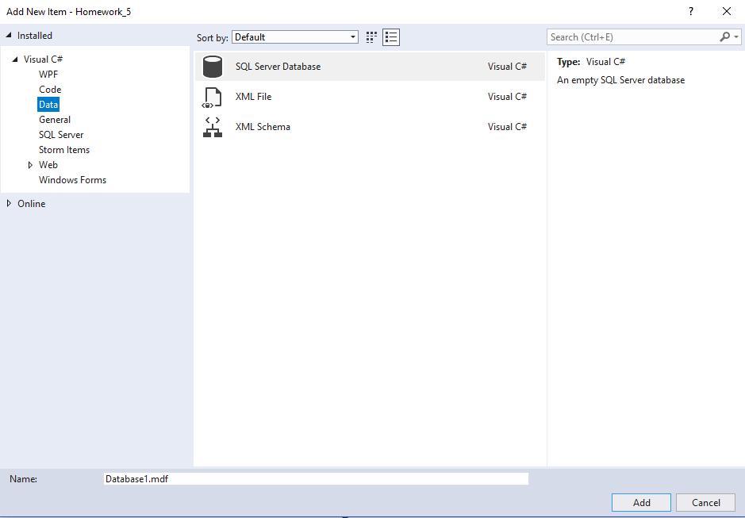
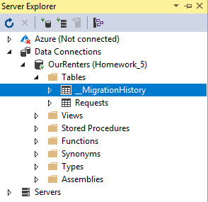
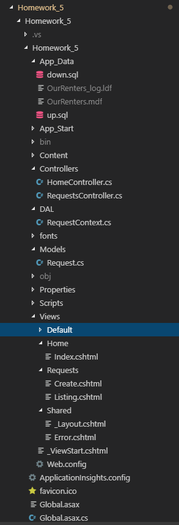
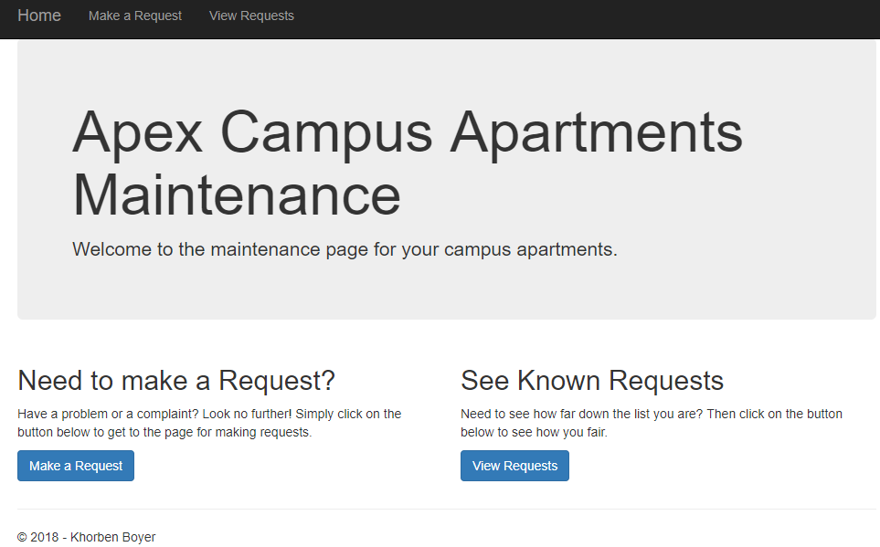
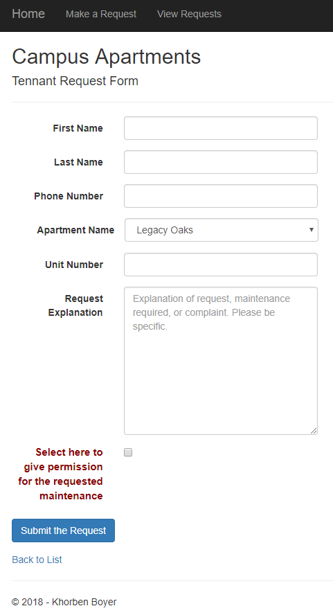
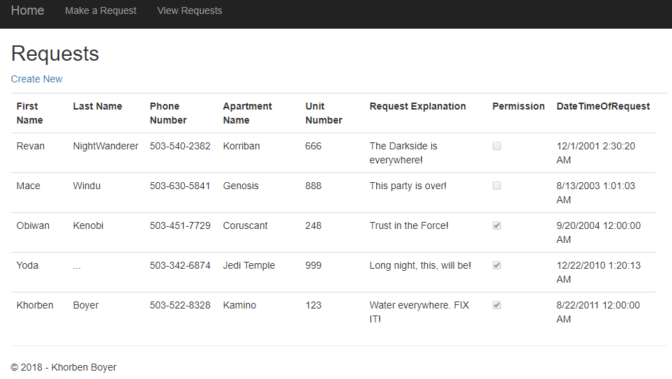
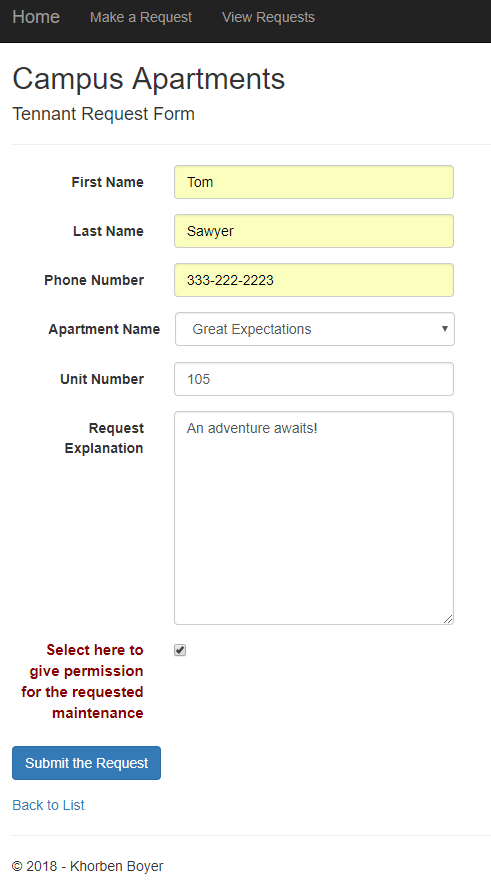
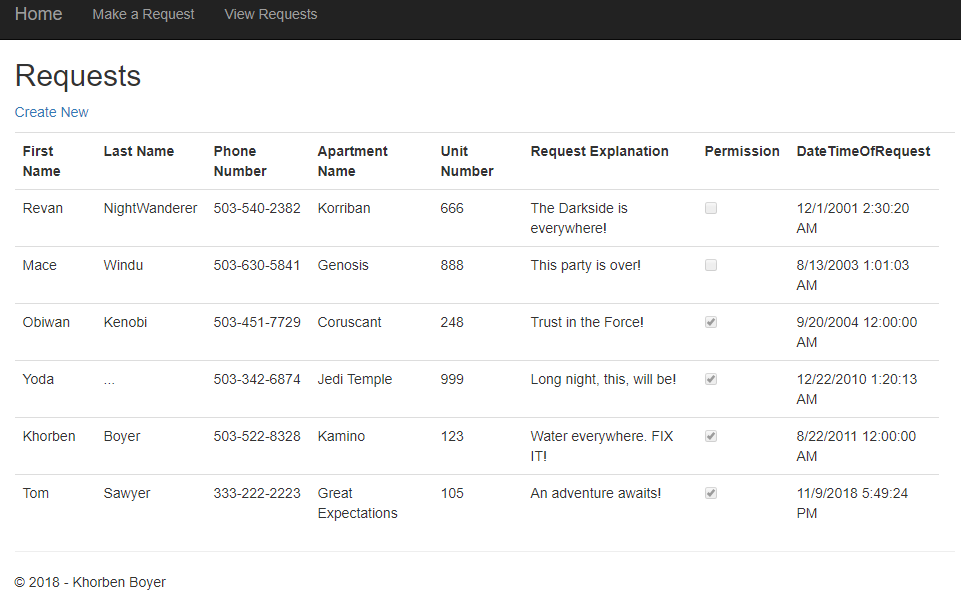

## Homework 5

For this week, our homework involved building a database-backed web application using ASP.NET MVC 5 in order to learn how to create and use a local database for persistent storage in a web app. We also began learning how to write T-SQL to create and populate a simple database both as part of the project and in order to be ready for more complicated databases in the upcoming homeworks. More exactly we had to write an MVC web app that used a simple one-table local database. To interface with this database, we had delve to more deeply into the Model-View-Controller paradigm and make a model class as well as data access layer class which served as the go between between the database and the more familiar controller/view components of the project.


### Homework 5 Links
1. [Home page](https://no-one-alone.github.io/)
2. [Assignment Page](http://www.wou.edu/~morses/classes/cs46x/assignments/HW5_1819.html)
3. [Code Repository](https://github.com/No-one-alone/no-one-alone.github.io)
4. [Final Video Demo](https://www.youtube.com/watch?v=bAsLXYbIFYY)
5. [Server-Side validation using Postman](https://www.youtube.com/watch?v=8WHSrMvnnqY)


### Part 1: Creation of ASP.NET MVC 5 web app with Visual Studio IDE

As before, we created the new empty MVC 5 web application using the same process seen in homework 4's blog along with adding the microsoft.net.compilers package to avoid the cloning issue.

### Part 2: Editing the MVC 5 project and adding features.

At the conclusion of this project, we had these edited or added files.

```
up.sql
down.sql
Request.cs
RequestContext.cs
Web.config
HomeControllers.cs
RequestsController.cs
Index.cshtml
Create.cshtml
Listing.cshtml
_Layout.cshtml

```

We will proceed to cover the use of the files in the project.

### Part 2.1: Database creation ⟶ local database under App_Data

First, we had create a database using the local database feature of visual studio seen here where we added it to the App_Data folder.



Note that this results in the creation of a "OurRenters.mdf" file and a "OurRenters_log.ldf" file in our App_Data folder due to being a local database.

After creating the up.sql file described in the next part and executing it, we then had our first table in the database seen here as "Requests". Ignore the migration history as it is not relevant.




### Part 2.2: Database table creation ⟶ up.sql and down.sql components

A standard sql file called up.sql was created in the App_Data folder to both create the database table for holding user requests and populating or seeding it with preexisting requests.

```sql

-- Creates the Requests table for users.
CREATE TABLE [dbo].[Requests]
(
	[ID]		          INT IDENTITY (1,1)	NOT NULL, -- Integer primary key for indexing.
	[FirstName]	          NVARCHAR(48)		    NOT NULL, -- Holds first name of requester.
	[LastName]	          NVARCHAR(48)		    NOT NULL, -- Holds last name of requester.
	[PhoneNumber]         NVARCHAR(12)		    NOT NULL, -- Holds phone number of requester.
	[ApartmentName]       NVARCHAR(48)		    NOT NULL, -- Holds apartment name of requester.
	[UnitNumber]          INT		            NOT NULL, -- Holds unit i.e. apartment number of requester.
	[RequestExplanation]  NVARCHAR(MAX)		    NOT NULL, -- Holds explanation given by requester.
	[Permission]          BIT					NOT NULL, -- 1 for Yes and 0 for No.

	[DateTimeOfRequest]   DateTime			    NOT NULL, -- Holds time stamp of when request was made and submitted.

	CONSTRAINT [PK_dbo.Requests] PRIMARY KEY CLUSTERED ([ID] ASC) -- Prevents table from being dropped if relations with foreign keys are present.
);

-- Inserts seed Request entries to populate table.
INSERT INTO [dbo].[Requests] (FirstName, LastName, PhoneNumber, ApartmentName, UnitNumber, RequestExplanation, Permission, DateTimeOfRequest) VALUES
	('Khorben','Boyer','503-522-8328','Kamino',123, 'Water everywhere. FIX IT!', 1,'2011-08-22 00:00:00'),
	('Revan','NightWanderer','503-540-2382','Korriban',666, 'The Darkside is everywhere!', 0,'2001-12-01 02:30:20'),
	('Obiwan','Kenobi','503-451-7729','Coruscant',248, 'Trust in the Force!', 1,'2004-09-20 00:00:00'),
	('Mace','Windu','503-630-5841','Genosis',888, 'This party is over!', 0,'2003-08-13 01:01:03'),
	('Yoda','...','503-342-6874','Jedi Temple',999, 'Long night, this, will be!', 1,'2010-12-22 01:20:13')
	
GO -- This is an SQL command batch terminator.

```
The "CREATE TABLE" expression makes the table while the "INSERT INTO" expression inserts the data entries.

As for removing the table with all of its entries, we created another sql file called down.sql which takes the table down using the following line of code.

```sql

-- Takes the Requests table down
DROP TABLE [dbo].[Requests];

```


### Part 2.3: Data Model ⟶ Request.cs component

This file was added under the Models folder to server as our model class for the project. Specifically, we will create instances of this class to access the database and its entries in the web app.

```cs


using System;
using System.Collections.Generic;
using System.Linq;
using System.Web;

// This was added to the standard empty template to allow for the data annotations seen below.
using System.ComponentModel.DataAnnotations;


/// <summary>
/// This is the namespace that contains the model class for the project.
/// </summary>
namespace Homework_5.Models
{

    /// <summary>
    /// This is the model class which actually contains the properties for interacting with the data.
    /// Note the use of various data annotations such as "Required", "StringLength", and "Display".
    /// </summary>
    public class Request
    {
        /// <summary>
        /// This the property for accessing the id of the database entries.
        /// </summary>
        [Key]
        public int ID { get; set; }

        /// <summary>
        /// This is the property for accessing the first name field of a database field.
        /// </summary>
        [Required]
        [StringLength(20)]
        [DataType(DataType.Text),
         RegularExpression(@"^[a-zA-Z ]*$",
         ErrorMessage = "Must be a name")]
        [Display(Name = "First Name")]
        public string FirstName { get; set; }

        /// <summary>
        /// This is the property for accessing last name field of a database field.
        /// </summary>
        [Required]
        [StringLength(20)]
        [DataType(DataType.Text),
         RegularExpression(@"^[a-zA-Z ]*$",
         ErrorMessage = "Must be a name")]
        [Display(Name = "Last Name")]
        public string LastName { get; set; }


        // Consulted Nick on how to do the validation.
        /// <summary>
        /// This is the property for accessing the phone number field of a database entry.
        /// </summary>
        [Required]
        [StringLength(12)]
        [DataType(DataType.PhoneNumber), 
         RegularExpression(@"^\d{3}-\d{3}-\d{4}$", 
         ErrorMessage = "Must have format: ###-###-####")]
        [Display(Name = "Phone Number")]
        public string PhoneNumber { get; set; }


        /// <summary>
        /// This is the property for accessing the apartment name field of a database entry.
        /// </summary>
        [Required]
        [StringLength(40)]
        [DataType(DataType.Text),
         RegularExpression(@"^[a-zA-Z ]*$",
         ErrorMessage = "Must be an apartment name")]
        [Display(Name = "Apartment Name")]
        public string ApartmentName { get; set; }


        /// <summary>
        /// This is the property for accessing the unit number field of a database entry.
        /// </summary>
        [Required]
        [DataType(DataType.Text),
         RegularExpression(@"^[0-9]*$",
         ErrorMessage = "Must be a number")]
        [Display(Name = "Unit Number")]
        public int UnitNumber { get; set; }


        /// <summary>
        /// This is the property for accessing the request explanation field of a database entry.
        /// </summary>
        [Required]
        [Display(Name = "Request Explanation")]
        public string RequestExplanation { get; set; }


        /// <summary>
        /// This is the property for accessing the permission field of a database entry.
        /// </summary>
        [Required]
        public bool Permission { get; set; }


        /// <summary>
        /// This is the property for accessing the data and time of request field of a database entry.
        /// </summary>
        [Required]
        public DateTime DateTimeOfRequest { get; set; }


        /// <summary>
        /// This an override ToString method.
        /// </summary>
        /// <returns>returns a string that represents the database fields</returns>
        public override string ToString()
        {
            return $"{base.ToString()}: {FirstName} {LastName} {PhoneNumber} {ApartmentName} {UnitNumber} {RequestExplanation} {Permission} {DateTimeOfRequest}";
        }
    }
}


```

Besides the use of C# automatic properties, we see the use of data annotations to help ensure validation of user input.

Examples include

```cs
[Required]

```

which indicates that the field in the form must be filled by the user.

```cs

[Display(Name = "First Name")]

```
This offers the ability to easily label the textboxes for user entries.

And this specifies a max length for the input if it is a string.

```cs

[StringLength(20)]

```

Finally, a more interesting annotation is this one 

```cs

[DataType(DataType.PhoneNumber), 
 RegularExpression(@"^\d{3}-\d{3}-\d{4}$", 
ErrorMessage = "Must have format: ###-###-####")]

```

Which provides validation for the formatting of the phone number via regular expression based pattern matching.


### Part 2.4: Data Access Layer ⟶ RequestContext.cs component

This file was added to the new DAL folder in the project to observe standard MVC 5 data access protocol.

```cs
// This file serves as our data access layer component of the project.

using System;
using System.Collections.Generic;
using System.Data.Entity; // This was added via installation of the entity framework.
using System.Linq;
using System.Web;

//This was added to gain access to our model class.
using Homework_5.Models;


/// <summary>
/// This is the namespace for our data access layer.
/// </summary>
namespace Homework_5.DAL
{

    /// <summary>
    /// This is the class that actually defines our data access layer.
    /// Note the use of the DbContext class.
    /// </summary>
    public class RequestContext : DbContext
    {

        /// <summary>
        /// This method allows us access to our named database with respect to web application itself
        /// </summary>
        public RequestContext() : base("name=OurRenters")
        {

        }

        /// <summary>
        /// Specifies what can be done with database with respect to extracting or inserting data.
        /// </summary>
        public virtual DbSet<Request> Requests { get; set; }
    }
}

```

Note the use of the "." notation to access the contents of different folders in our project like the DAL or Models.

Furthermore, this is a rather minimal subclass of DbContext class seen above for constructing our database object and specifying how it can be accessed via the appropriate C# property seen above.


### Part 2.5: Connection String ⟶ Web.config component

We then had to connect everything - the database, model, and DAL file - via inserting this code into into Web.config part of the project.

```html

  <!-- This connection string was added for the homework_5 project to allow connection to our local database for the web app.-->
  <connectionStrings>
    <add name="OurRenters" connectionString="Data Source=(LocalDB)\MSSQLLocalDB;AttachDbFilename=C:\Users\khorb\CS_SENIOR_PROJECT\CS_460\no-one-alone.github.io\Homework_5\Homework_5\Homework_5\App_Data\OurRenters.mdf;Integrated Security=True" providerName="System.Data.SqlClient" />
  </connectionStrings>


```

### Part 2.6: Landing page ⟶ _Layout.cshmtl component

This preexisting file in the project was pretty much identical to homework 4's with the relevant change being the addition of the action links seen here.

```cs
...

@*This action link was added to take the user to the "Make a Request" webpage.*@
<li>@Html.ActionLink("Make a Request", "Create", "Requests")</li>

@*This action link was added to take the user to the "View Requests" webpage.*@
<li>@Html.ActionLink("View Requests", "Listing", "Requests")</li>

...

```

### Part 2.7 Landing page ⟶ Index.cshtml

This preexisting file in the project was pretty identical to homework 4's excepting changing the descriptions and other text on the landing page to that seen in the final results section of this blog.

The action links for the buttons to take the user to the "Make a Request" and the "View Requests" webpages of the project are seen here.

```html
...

@*This specifies the button that links and takes the user to the "make a request" page via a Razor Html.ActionLink()
  The first parameter gives the name of the button, the second gives the name of a controller function i.e. Create(),
  and the third, the name of the folder that contains the file with the appropriate View.*@                                <p><a class="btn btn-primary" @Html.ActionLink("Make a Request", "Create", "Requests") </a></p>

...

@* This is the button for the user to click.
   It is a Razor Html.ActionLink where the first paramenter specifies the text of the button, the second is
   the name of the relevant controller function i.e Listing(), and the third is the name of the folder that contains the Views.*@
   <p><a class="btn btn-primary" @Html.ActionLink("View Requests", "Listing", "Requests") </a></p>

   ...

```


### Part 2.8:  View for "Make a Request" ⟶ Create.cshtml

This new file which was added to the project was responsible for generating the web page with the appropriate forms for taking in the user input that defined a request upon pressing the submit button. Note that this web page and its forms can be seen in the final results section of this blog.

```cs


@* This file contains our strongly typed view for the "Make a Request" webpage.*@

@*This establishes our strongly typed view.*@
@model Homework_5.Models.Request

@{
    ViewBag.Title = "Request Submission";
}

<h2>Campus Apartments</h2>

@* This is a Razor HTML helper for making forms.*@
@using (Html.BeginForm())
{
    @Html.AntiForgeryToken() 


@*The HTML elements below define our form elements for the page.*@
<div class="form-horizontal">
    <h4>Tennant Request Form</h4>
    <hr />
    @Html.ValidationSummary(true, "", new { @class = "text-danger" })

    @*This creates the textbox for the first name to be entered by the user.*@
    <div class="form-group">
        @Html.LabelFor(model => model.FirstName, htmlAttributes: new { @class = "control-label col-md-2" })
        <div class="col-md-10">
            @Html.EditorFor(model => model.FirstName, new { htmlAttributes = new { @class = "form-control" } })
            @Html.ValidationMessageFor(model => model.FirstName, "", new { @class = "text-danger" })
        </div>
    </div>

    @*This creates the textbox for the last name to be entered by the user.*@
    <div class="form-group">
        @Html.LabelFor(model => model.LastName, htmlAttributes: new { @class = "control-label col-md-2" })
        <div class="col-md-10">
            @Html.EditorFor(model => model.LastName, new { htmlAttributes = new { @class = "form-control" } })
            @Html.ValidationMessageFor(model => model.LastName, "", new { @class = "text-danger" })
        </div>
    </div>

    @*This creates the textbox for the phone number to be entered by the user.*@
    <div class="form-group">
        @Html.LabelFor(model => model.PhoneNumber, htmlAttributes: new { @class = "control-label col-md-2" })
        <div class="col-md-10">
            @Html.EditorFor(model => model.PhoneNumber, new { htmlAttributes = new { @class = "form-control" } })
            @Html.ValidationMessageFor(model => model.PhoneNumber, "", new { @class = "text-danger" })
        </div>
    </div>


    @*Consulted Dominic on how to do a drop down list*@
    @*This creates a dropdown list for the user to select a valid apartment from.*@
    <div class="form-group" style="padding-left:20px">
         @Html.LabelFor(model => model.ApartmentName, htmlAttributes: new { @class = "control-label col-md-2" }) 

        
         @Html.DropDownListFor(model => Model.ApartmentName, new List<SelectListItem>
         {
            new SelectListItem{ Text="Legacy Oaks", Value = "Legacy Oaks" },
            new SelectListItem{ Text="Riverplace", Value = "Riverplace" },
            new SelectListItem{ Text="Riverside Condos", Value = "Riverside Condos" },
            new SelectListItem{ Text="Great Expectations", Value = "Great Expectations" },
            new SelectListItem{ Text="Ridgeline", Value = "Ridgeline" },
            new SelectListItem{ Text="Heritage Hall", Value = "Heritage Hall" },
            new SelectListItem{ Text="Ackerman Hall", Value = "Ackerman Hall" },
            new SelectListItem{ Text="Landers Hall", Value = "Landers Hall" },
         }, new { @class="form-control"})

           
        <div class="col-md-10">
          @*  @Html.EditorFor(model => model.ApartmentName, new { htmlAttributes = new { @class = "form-control" } }) *@
            @Html.ValidationMessageFor(model => model.ApartmentName, "", new { @class = "text-danger" })
        </div>
    </div>


    @*This creates a textbox for the unit number to be entered by the user.*@
    <div class="form-group">
        @Html.LabelFor(model => model.UnitNumber, htmlAttributes: new { @class = "control-label col-md-2" })
        <div class="col-md-10">
            @Html.EditorFor(model => model.UnitNumber, new { htmlAttributes = new { @class = "form-control" } })
            @Html.ValidationMessageFor(model => model.UnitNumber, "", new { @class = "text-danger" })
        </div>
    </div>


    @*This creates a text area box for the explanation of request to be entered by the user.*@
    <div class="form-group">
        @Html.LabelFor(model => model.RequestExplanation, htmlAttributes: new { @class = "control-label col-md-2" })
        <div class="col-md-10">
            @Html.TextAreaFor(model => model.RequestExplanation, htmlAttributes: new { @class = "form-control", @rows = 10, @placeholder = "Explanation of request, maintenance required, or complaint. Please be specific." })
            @Html.ValidationMessageFor(model => model.RequestExplanation, "", new { @class = "text-danger" })
        </div>
    </div>


    @*This creates a checkbox for whether permission is to be given by the user.*@
    <div class="form-group">
        @Html.Label("Select here to give permission for the requested maintenance", htmlAttributes: new { @class = "control-label col-md-2", @style = "color:darkred; font-size: 15px; top: -8px;" })

        <div class="col-md-10">
           
            @Html.CheckBoxFor(model => model.Permission)

        </div>

    </div>


    @* This creates the button for submitting the form.*@
    <div class="form-group">
        <div class="col-md-4">
            <input id="btnSubmitForm" name="submit" class="btn btn-primary submitted" type="submit" value="Submit the Request" />

        </div>
    </div>

</div>
}

@*This action link takes the user back to the "View Requests" web page.*@
<div>
    @Html.ActionLink("Back to List", "Listing")
</div>

@*

@section Scripts {
    @Scripts.Render("~/bundles/jqueryval")
}

*@

```

As in the last assignment, we see the familar razor language HTML helpers from before along with some new ones seen here.

```cs
...

  @Html.ValidationSummary(true, "", new { @class = "text-danger" })
...

```
The ValidationSummary helper method seen above generates an unordered list (ul element) of validation messages that are in the ModelStateDictionary object.

Furthermore, the ValidationSummary can be used to display all the error messages for all the fields. It can also be used to display custom error messages. 


```cs
...
  @Html.LabelFor(model => model.FirstName, htmlAttributes: new { @class = "control-label col-md-2" })
...
```

The LabelFor helper method, on the other hand, is a strongly typed extension method. It generates a html label element for the model object property specified using a lambda expression as seen above.

```cs
...
  @Html.EditorFor(model => model.FirstName, new { htmlAttributes = new { @class = "form-control" } })
...
```

Next, the EditorFor helper extension method generates html elements based on the data type of the model object's property as above.


```cs
...
  @Html.ValidationMessageFor(model => model.FirstName, "", new { @class = "text-danger" })
...

```

Then, we have the ValidateMessageFor helper which is another strongly typed extension method for displaying a validation message if an error exists for the specified field in the ModelStateDictionary object.


```cs
...
 @Html.DropDownListFor(model => Model.ApartmentName, new List<SelectListItem>
 {
    ...
 }, new { @class="form-control"})
...

```

The DropDownListFor helper method is yet another strongly typed extension method. It generates a 'select' element for the property specified using a lambda expression. 

```cs
...
 @Html.TextAreaFor(model => model.RequestExplanation, htmlAttributes: new { @class = "form-control", @rows = 10, @placeholder = "Explanation of request, maintenance required, or complaint. Please be specific." })
...
```
The TextAreaFor helper method is, no surprise here, a strongly typed extension method. It generates a multi line 'textarea' element for the property in the model object specified using a lambda expression.


```cs
...
@Html.Label("Select here to give permission for the requested maintenance", htmlAttributes: new { @class = "control-label col-md-2", @style = "color:darkred; font-size: 15px; top: -8px;" })
...
```

Finally, we have the Label helper which generates a 'label' element for a specified property of the model object.

Alltogether, these examples of Razor language code allowed us to write a multi-form page quickly and relatively painlessly as opposed to having done just pure html form elements instead.

In addition, at the top of the file was the code seen here.

```cs
@*This establishes our strongly typed view.*@
@model Homework_5.Models.Request

```
Which just as commented helps to create our strong typed view for use in rendering the different aspects of our model object and accessing it in safe manner along with better compile time safety features.


We also have an action link that take a user back to the "View Requests" webpage.

```cs
   @Html.ActionLink("Back to List", "Listing")
```

### Part 2.9:  View for "View Requests" ⟶ Listing.cshtml

This new added file was responsible for generating the webpage for the "View requests" web page where the user could see all of the previous requests including their own in a list format ordered oldest-first.

```cs

@* this file contains our strong typed view for the "View Request" webpage.*@

@*This defines our strongly typed view and specifies that it is of enumerable type.*@
@model IEnumerable<Homework_5.Models.Request>

@{
    ViewBag.Title = "Requests List";
}

<h2>Requests</h2>

@*This a link to take the user back to the "Make a Request" web page*@
<p>
    @Html.ActionLink("Create New", "Create")
</p>
<table class="table">

    
        @*This specifies the headers for the columns of the table list to be created for being viewed by the user.*@
        @*Note that all of the database data fields are present.*@
        <tr>
            <th>
                @Html.DisplayNameFor(model => model.FirstName)
            </th>
            <th>
                @Html.DisplayNameFor(model => model.LastName)
            </th>
            <th>
                @Html.DisplayNameFor(model => model.PhoneNumber)
            </th>

            <th>
                @Html.DisplayNameFor(model => model.ApartmentName)
            </th>

            <th>
                @Html.DisplayNameFor(model => model.UnitNumber)
            </th>

            <th>
                @Html.DisplayNameFor(model => model.RequestExplanation)
            </th>

            <th>
                @Html.DisplayNameFor(model => model.Permission)
            </th>

            <th>
                @Html.DisplayNameFor(model => model.DateTimeOfRequest)
            </th>

            <th></th>
        </tr>

   
    @*This iterates through the database object and displayes each database entry with all its data fields as a row in the table listing.*@
    @foreach (var item in Model)
    {
    <tr>
        <td>
            @Html.DisplayFor(modelItem => item.FirstName)
        </td>
        <td>
            @Html.DisplayFor(modelItem => item.LastName)
        </td>
        <td>
            @Html.DisplayFor(modelItem => item.PhoneNumber)
        </td>

        <td>
            @Html.DisplayFor(modelItem => item.ApartmentName)
        </td>


        <td>
            @Html.DisplayFor(modelItem => item.UnitNumber)
        </td>

        <td>
            @Html.DisplayFor(modelItem => item.RequestExplanation)
        </td>


        <td>
            @Html.DisplayFor(modelItem => item.Permission)
        </td>

        <td>
            @Html.DisplayFor(modelItem => item.DateTimeOfRequest)
        </td>


    </tr>
    }

</table>


```

The new Razor helpers here consist of

```cs
...
 @Html.DisplayNameFor(model => model.FirstName)
...
```

And

```cs
 @foreach (var item in Model)
 {

...
      @Html.DisplayFor(modelItem => item.UnitNumber)
...

 }

```

The DisplayNameFor helper returns the display name for the specified expression for the current model as a collection.

This how the headers of the columns in the table were obtained.

While the Displayfor displays the actual value of the specified expression in a consistent manner thus giving us the data found in each of the fields of the table.

Note that the latter helper is wrapped in the foreach loop above which allows for iterating through each of entries in the model and thus displaying each of the request entries in the database.

Lastly as in the other view, we see the creation of a strongly typed view with the enumerable characteristic enabled by this code.

```cs

@*This defines our strongly typed view and specifies that it is of enumerable type.*@
@model IEnumerable<Homework_5.Models.Request>

```

Note the presence of another action link to take the user back to the "Make a Request" page.

```cs
 @Html.ActionLink("Create New", "Create")

```

### Part 2.10:  Controller for the "Make a Request" webpage ⟶ RequestsController.cs

Rather using the the HomeController.cs file that was already in the project, a new controller file called RequestsController was created and added to the Controllers folder.

```cs


// This file is the requests controller for the "make a request" and "view requests" web pages of our project.

using System;
using System.Collections.Generic;
using System.Linq;
using System.Web;
using System.Web.Mvc;

// These were added to allow access to the model class and data access layer files of our project.
using Homework_5.DAL;
using Homework_5.Models;

/// <summary>
/// This is the namespace of our requests controller.
/// </summary>
namespace Homework_5.Controllers
{

    /// <summary>
    /// This the class that actually defines our requests controller for the project.
    /// </summary>
    public class RequestsController : Controller
    {
        // GET:
        /// <summary>
        /// This creates a new instance of our database for accessing its data as seen below.
        /// </summary>
        private RequestContext database = new RequestContext();

        /// <summary>
        /// This is a GET request style ActionResult controller function for returning the home page.
        /// </summary>
        /// <returns> returns the homepage</returns>
        [HttpGet]
        public ActionResult Index()
        {
            ViewBag.Message = "Your home page.";
            
            return View();
        }

        // GET: Requests
        /// <summary>
        /// This is a GET request style ActionResult controller function for returning a sort list of the database entries to the "View Requests" webpage.
        /// </summary>
        /// <returns>returns a list sorted oldest-first to View Requests</returns>
        [HttpGet]
        public ActionResult Listing()
        {
            List<Request> list = database.Requests.ToList(); // Converts database object to list object.
            var sortedList = list.OrderBy(time => time.DateTimeOfRequest); // sorted the list by time so that oldest entry appears first.
            return View(sortedList); // returns the sorted list to the View defined by Listing
        }

        //GET: Requests/Create
        /// <summary>
        /// This is a GET request style Action Result controller function for returning the Make a Request web page.
        /// </summary>
        /// <returns>Just returns the webpage defined by Create. </returns>
        [HttpGet]
        public ActionResult Create()
        {
            return View();
        }

        // POST: Requests/Create
        // To protect from overposting attacks, please enable the specific properties you want to bind to, for 
        // more details see https://go.microsoft.com/fwlink/?LinkId=317598.
        /// <summary>
        /// This is a POST request style Action Result controller for getting the form data entered by the user after being submitted and redirecting the user to the View Requests webpage.
        /// </summary>
        /// <param name="request">Takes in the user entered data values</param>
        /// <returns>Takes the user to the View requests webpage if all data entered was valid, otherwise returns the make a request page as is</returns>
        [HttpPost]
        //[ValidateAntiForgeryToken]
        public ActionResult Create([Bind(Include = "FirstName, LastName, PhoneNumber, ApartmentName, UnitNumber, RequestExplanation, Permission, DateTimeOfRequest")] Request request)
        {
            if (ModelState.IsValid) // checks if all data entered was in line with the model requirements.
            {
                request.DateTimeOfRequest = DateTime.Now; // Sets the DateTimeOfRequest field to the current time as our means of time stamping requests as they are made.
                database.Requests.Add(request); // Adds the user supplied data to the database object.
                database.SaveChanges(); // Saves the changes due to new data to the database as new database entries.

                // Redirect POST request to GET request as per required GET-POST-Redirect pattern.
                // Basically takes the user to the View Requests webpage after making a succesful submission on the Make a Request webpage.
                return RedirectToAction("Listing");
            }

            // returns current Make a Request webpage in the event of the user supplying invalid data.
            return View(request);
        }
    }
}


```

In this file, the two most important Action Result controller functions are these.

```cs
...
[HttpGet]
public ActionResult Listing()
{
     List<Request> list = database.Requests.ToList(); // Converts database object to list object.
     var sortedList = list.OrderBy(time => time.DateTimeOfRequest); // sorted the list by time so that oldest entry appears first.
      return View(sortedList); // returns the sorted list to the View defined by Listing
}

...

```
And

```cs
...
[HttpPost]
//[ValidateAntiForgeryToken]
 public ActionResult Create([Bind(Include = "FirstName, LastName, PhoneNumber, ApartmentName, UnitNumber, RequestExplanation, Permission, DateTimeOfRequest")] Request request)
{
     if (ModelState.IsValid) // checks if all data entered was in line with the model requirements.
     {
          request.DateTimeOfRequest = DateTime.Now; // Sets the DateTimeOfRequest field to the current time as our means of time stamping requests as they are made.
          database.Requests.Add(request); // Adds the user supplied data to the database object.
          database.SaveChanges(); // Saves the changes due to new data to the database as new database entries.

          // Redirect POST request to GET request as per required GET-POST-Redirect pattern.
          // Basically takes the user to the View Requests webpage after making a succesful submission on the Make a Request webpage.
          return RedirectToAction("Listing");
     }

     // returns current Make a Request webpage in the event of the user supplying invalid data.
     return View(request);
}

...
```

The Listing() controller function is responsible for converting the database object to a list object and sorting the entries in the resultant list in older-first fashion followed by displaying them to the user in the "View Requests" webpage in list table format.

The non-default Create(...) controller function is responsible for obtaining and validating user input entered in the "Make a Request" web page. Note that it is also responsible for giving each valid request a timestamp when the request is submitted.

Upon a valid request being submitted, the user is then redirected and taken from the "Make a Request" webpage and to the "View Requests" webpage.

Note that all of this is done through an instance of the Model class rather than through using ViewBag as done in homework 4.


### Part 3: Final Results


This shows how the overall file structure of my homework #5 project was organized in Visual Studio Code which is just a bit different compared to the last homework due to the addition of files under the Models, DAL, and App_Data folders.




And this is a picture of the landing page of the web app.



Furthermore, the "Make a Request" web page can be seen here.



And the related "View Requests" page here.



Note how the entries are sorted and ordered from oldest-first.

Lastly, we can see these pages in action via the valid submission here.



Followed by the redirect to the request list here with the new entry at the bottom.



As we can see, everything has been implemented regarding our ASP.NET MVC 5 web application and can be seen to work both according to the above screenshots and the video demo in the link at the top with respect to validation.

In general, this was a trying but useful experience in becoming aquainted with creating and utilizing the ASP.NET MVC 5 platform for creating web applications under the Model-View-Controller paradigm with a local database for persistent storage.