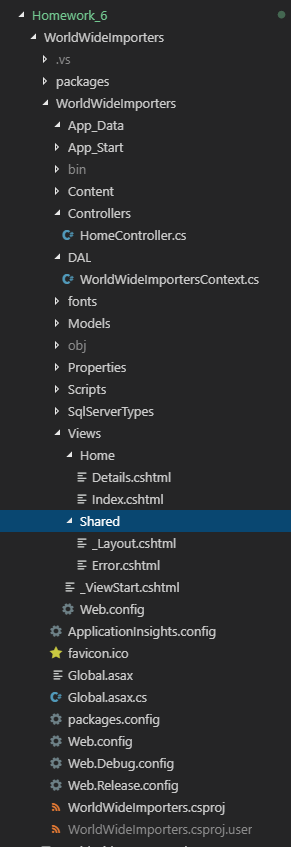
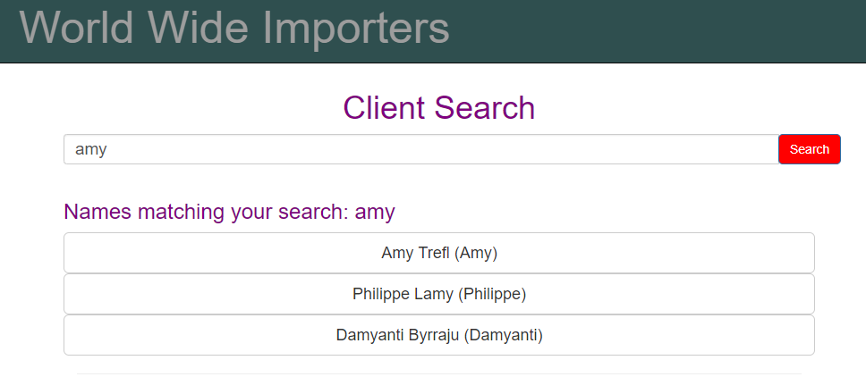
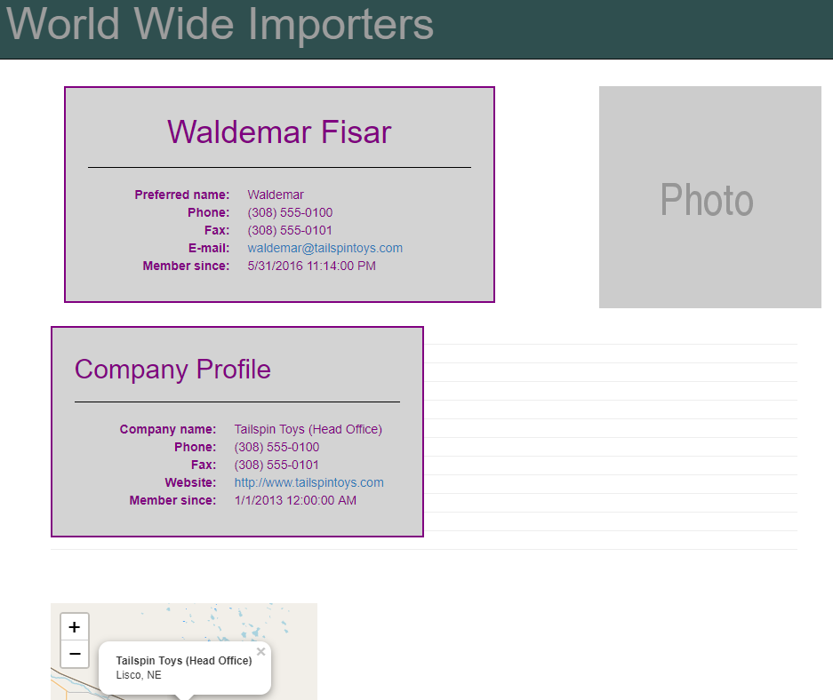
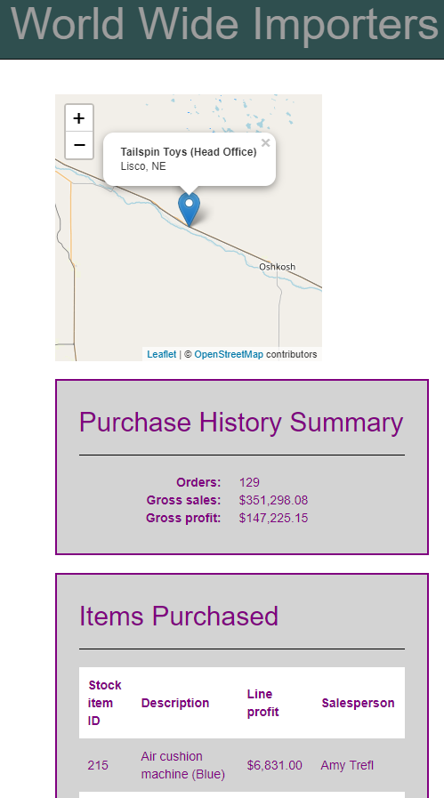

## Homework 6

For this week, our homework involved being able to write a MVC web application that made use of a large complex preexisting database that we did not create ourselves. The objectives included practicing the "Code first from an Existing Database" workflow, using strongly-typed views, using a ViewModel to send complex data to a view, and using fluent LINQ syntax to access and extract the data required. That is, we created a "search engine" that could look up people and allowed to see details regarding these persons such as contact info, related company, and location.


### Homework 6 Links
1. [Home page](https://no-one-alone.github.io/)
2. [Assignment Page](http://www.wou.edu/~morses/classes/cs46x/assignments/HW6_1819.html)
3. [Code Repository](https://github.com/No-one-alone/no-one-alone.github.io)
4. [Final Video Demo](https://www.youtube.com/watch?v=S8kmBTW39kU&feature=youtu.be)


### Part 1: Creation of ASP.NET MVC 5 web app with Visual Studio IDE

As before, we created the new empty MVC 5 web application using the same process seen in homework 5's blog.

### Part 2: Editing the MVC 5 project and adding features.

At the conclusion of this project, we had these edited or added files.

```
Site.css
HomeController.cs
WorldWideImportersContext.cs
Details.cshtml
Index.cshtml
_Layout.cshtml
DisplayModel.cs

... and Lots and Lots of model classes generating from the World Wide Importers database.


```

Due to both number of files involved and the familarity we have with many of the above kinds of files from experience in working with them in previous homeworks, we shall proceed to cover only the highlights of the development process.

### Part 2.1: Restoring the database

First, we had to restore the database using Microsoft SQL managenment studio and establishing a connection to it for access in visual studio. Then all of model classes were generated from the non archive tables of the database. These were place into the Models folder of the project and the related WorldWideImportersContext data access file was place into the DAL folder.


### Part 2.2 Making the search engine

We proceeded to make use of one controller, HomeController.cs, to implement the action result functions seen here.

```cs


using System;
using System.Collections.Generic;
using System.Linq;
using System.Web;
using System.Web.Mvc;


// added these
using WorldWideImporters.Models;
using WorldWideImporters.Models.ViewModels;

/// <summary>
/// This is the namespace that contains the action result functions for homework 6
/// </summary>
namespace WorldWideImporters.Controllers
{
    /// <summary>
    /// This is the class that actually defines HomeController
    /// Note that it is derived from the Controller class.
    /// </summary>
    public class HomeController : Controller
    {
        /// <summary>
        /// This creats an instance entity object of the Worldwide importers database for the controllers to interact with.
        /// </summary>
        private WorldWideImportersContext database = new WorldWideImportersContext();
  
        /// <summary>
        ///  This action result function gets the list of people that the match or contain the inputted text.
        /// </summary>
        /// <param name="query">this takes in the inputted user string</param>
        /// <returns>this returns the view possibly with name info</returns>
        [HttpGet]
        public ActionResult Index(string query)
        {
            // the display model
            DisplayModel displaymodel = new DisplayModel();

           

            // this checks if the query contianed text to analyze.
            if (query == "" || query == null)
            {
                ViewBag.show = false; // sets flag to false.

                return View();
            }
            else
            {
                ViewBag.show = true; // sets flag to true.

                ViewBag.querycontent = "Names matching your search: " + query;

                // returns list of possible name matches.
                return View(database.People.Where(name => name.FullName.ToUpper().Contains(query.ToUpper())).ToList());
            }
           
        }


        /// <summary>
        /// This action result function gives us the details of a given person.
        /// Additional details beyond this are given for person who are the primary representative of a given company.
        /// </summary>
        /// <param name="id">takes in a int id.</param>
        /// <returns>returns the display view model.</returns>
        public ActionResult Details(int? id)
        {
            // the display model
            DisplayModel displaymodel = new DisplayModel();

            // finds the person
            displaymodel.MyPerson = database.People.Find(id);

            // initializes check value to false.
            ViewBag.IsPrimaryContactPerson = false;

            // this checks if the customer is a primary representative of a company.
            if(displaymodel.MyPerson.Customers2.Count()>0)
            {
                // sets flag to true.
                ViewBag.IsPrimaryContactPerson = true;


                //this gets the customer id.
                ViewBag.IsP = true;
                int cid = displaymodel.MyPerson.Customers2.FirstOrDefault().CustomerID;
                displaymodel.MyCustomer = database.Customers.Find(cid);

                //this finds the gross sales
                ViewBag.GrossSales = displaymodel.MyCustomer.Orders
                                        .SelectMany(order => order.Invoices)
                                        .SelectMany(invoice => invoice.InvoiceLines)
                                        .Sum(invoiceline => invoiceline.ExtendedPrice);

                //this finds the gross profit
                ViewBag.GrossProfit = displaymodel.MyCustomer.Orders
                                         .SelectMany(order => order.Invoices)
                                         .SelectMany(invoice => invoice.InvoiceLines)
                                         .Sum(invoiceline => invoiceline.LineProfit);

                //this selects the information on the top ten sales
                displaymodel.MyInvoiceLine = displaymodel.MyCustomer.Orders.SelectMany(order => order.Invoices)
                                                .SelectMany(invoice => invoice.InvoiceLines)
                                                .OrderByDescending(invoiceline => invoiceline.LineProfit)
                                                .Take(10)
                                                .ToList();
            }
            return View("Details", displaymodel);
        }
    }
}


```

As is readily apparent, the truly new aspects are the LINQ queries for accessing the various sorts data in the database through the appropriate objects as seen here.

```cs
...
// returns list of possible name matches.
return View(database.People.Where(name => name.FullName.ToUpper().Contains(query.ToUpper())).ToList());
...
 //this gets the customer id.
 ViewBag.IsP = true;
int cid = displaymodel.MyPerson.Customers2.FirstOrDefault().CustomerID;
displaymodel.MyCustomer = database.Customers.Find(cid);

//this finds the gross sales
ViewBag.GrossSales = displaymodel.MyCustomer.Orders
                        .SelectMany(order => order.Invoices)
                        .SelectMany(invoice => invoice.InvoiceLines)
                        .Sum(invoiceline => invoiceline.ExtendedPrice);

//this finds the gross profit
ViewBag.GrossProfit = displaymodel.MyCustomer.Orders
                         .SelectMany(order => order.Invoices)
                         .SelectMany(invoice => invoice.InvoiceLines)
                         .Sum(invoiceline => invoiceline.LineProfit);

//this selects the information on the top ten sales
displaymodel.MyInvoiceLine = displaymodel.MyCustomer.Orders.SelectMany(order => order.Invoices)
                        .SelectMany(invoice => invoice.InvoiceLines)
                        .OrderByDescending(invoiceline => invoiceline.LineProfit)
                        .Take(10)
                        .ToList();


```
Note the use of the View Model in the form of the DisplayModel.cs file from which create we create display instances for handling large amounts of complex data such as the list information regarding the top ten sales.


### Part 2.3 Making the search Engine page.

The landing page compared to previous homeworks was quite simple to make as we stripped down the Layout file and edited the index view file in this manner.

```cs
@*This is the file for the landing page of the project*@

@* everthing not commented was added*@

@model IEnumerable<WorldWideImporters.Models.Person>

@{
    ViewBag.Title = "Home Page";
}

<div class="row">

    <br />
    <br />

    <h1 id="title">Client Search</h1>
    <div class="col-sm-24">
        @using (Html.BeginForm("Index", "Home", FormMethod.Get, new { @class = "form-inline" }))
        {

            <div class="input-group">
                <span class="input-group-btn">

                    @Html.TextBox("query", null, new { @class = "form-control" })

                    <button class="btn btn-primary" style="background-color: red; border-radius: 5px;" type="submit" id="formbtn">Search</button>

                </span>

            </div>

            <br />
            <br />

            if (ViewBag.show)
            {
                if (Model.Count() == 0)
                {
                    <h4>I'm sorry, your search returned no results</h4>
                }
                else
                {
                    <h3> @ViewBag.querycontent</h3>


                    foreach (var person in Model)
                    {
                        <div>
                            <a class="btn btn-default btn-lg btn-block" href="Home/Details/@person.PersonID" role="button">@person.FullName (@person.PreferredName)</a>
                        </div>
                    }
                }
            }
        }
    </div>
</div>


```

As can be seen, this involved a combination of prior learned knowledge such as html input buttions and razor code but nonething too difficult.


### Part 2.4 Making the search Engine Details page.

On the other hand, the details page meant to accessible for each found entry or person involved quite a bit more work as seen here.

```cs


@*@model WorldWideImporters.Models.Person *@

@model WorldWideImporters.Models.ViewModels.DisplayModel

@{
    ViewBag.Title = "Details";
}


@section Header
{
    <link rel="stylesheet" href="https://unpkg.com/leaflet@1.3.4/dist/leaflet.css"
          integrity="sha512-puBpdR0798OZvTTbP4A8Ix/l+A4dHDD0DGqYW6RQ+9jxkRFclaxxQb/SJAWZfWAkuyeQUytO7+7N4QKrDh+drA=="
          crossorigin="" />

    <!-- Make sure you put this AFTER Leaflet's CSS -->
    <script src="https://unpkg.com/leaflet@1.3.4/dist/leaflet.js"
            integrity="sha512-nMMmRyTVoLYqjP9hrbed9S+FzjZHW5gY1TWCHA5ckwXZBadntCNs8kEqAWdrb9O7rxbCaA4lKTIWjDXZxflOcA=="
            crossorigin=""></script>
}


<br />
<br />
<br />

@*Displays Person information*@
<div class="container">
    <div class="row">
        <div class="col-sm-6 details-box">
            <h1>@Html.DisplayFor(model => model.MyPerson.FullName)</h1>
            <hr style="border-color: black;" />
            <dl class="dl-horizontal">
                <dt>Preferred name:</dt>
                <dd>@Html.DisplayFor(model => model.MyPerson.PreferredName)</dd>

                <dt>Phone:</dt>
                <dd>@Html.DisplayFor(model => model.MyPerson.PhoneNumber)</dd>

                <dt>Fax:</dt>
                <dd>@Html.DisplayFor(model => model.MyPerson.FaxNumber)</dd>

                <dt>E-mail:</dt>
                <dd><a href="mailto:@Html.DisplayFor(model => model.MyPerson.EmailAddress)">@Html.DisplayFor(model => model.MyPerson.EmailAddress)</a></dd>

                <dt>Member since:</dt>
                <dd>@Html.DisplayFor(model => model.MyPerson.ValidFrom)</dd>
            </dl>
        </div>

        <a href="https://placeholder.com"></a>

    </div>
</div>

<br />


@*This controls whether view needs to show additional details.*@
@if (ViewBag.IsPrimaryContactPerson)
{

<table>
    <div class="row">
        <div class="col-sm-6 details-box">
            <h2>Company Profile</h2>
            <hr style="border-color: black;" />
            <dl class="dl-horizontal">
                <dt>Company name:</dt>
                <dd>@Html.DisplayFor(model => model.MyCustomer.CustomerName)</dd>

                <dt>Phone:</dt>
                <dd>@Html.DisplayFor(model => model.MyCustomer.PhoneNumber)</dd>

                <dt>Fax:</dt>
                <dd>@Html.DisplayFor(model => model.MyCustomer.FaxNumber)</dd>

                <dt>Website:</dt>
                <dd><a href="@Html.DisplayFor(model => model.MyCustomer.WebsiteURL)">@Html.DisplayFor(model => model.MyCustomer.WebsiteURL)</a></dd>

                <dt>Member since:</dt>
                <dd>@Html.DisplayFor(model => model.MyCustomer.ValidFrom)</dd>
            </dl>
        </div>


        <hr>
        <hr>
        <hr>
        <hr>
        <hr>
        <hr>
        <hr>
        <hr>
        <hr>
        <hr>
        <hr>
        <hr>

        @*Extra company site map*@
        <div class="column" id="mapentry">

            <br />
            <br />

            <div id="map" style="height: 300px; width: 300px;"></div>
            <script>
            var longitude = @Model.MyCustomer.DeliveryLocation.Longitude;
            var latitude = @Model.MyCustomer.DeliveryLocation.Latitude;

            var map = L.map('map').setView([latitude, longitude ], 9);

             L.tileLayer('https://{s}.tile.openstreetmap.org/{z}/{x}/{y}.png', {
            attribution: '&copy; <a href="https://www.openstreetmap.org/copyright">OpenStreetMap</a> contributors'
                }).addTo(map);


            L.marker([latitude, longitude]).addTo(map).bindPopup('<b>' + '@Model.MyCustomer.CustomerName' + '</b>' + '<br>' + '@Model.MyCustomer.City.CityName' + ', ' + '@Model.MyCustomer.City.StateProvince.StateProvinceCode').openPopup();

            </script>

        </div>

    </div>

</table>

    <br />

    <div class="row">
        <div class="col-sm-6 details-box">
            <h2>Purchase History Summary</h2>
            <hr style="border-color: black;" />
            <dl class="dl-horizontal">
                <dt>Orders:</dt>
                <dd>@Html.DisplayFor(model => model.MyCustomer.Orders.Count)</dd>

                <dt>Gross sales:</dt>
                <dd>@String.Format("{0:C}", ViewBag.GrossSales)</dd>

                <dt>Gross profit:</dt>
                <dd>@String.Format("{0:C}", ViewBag.GrossProfit)</dd>
            </dl>
        </div>
    </div>

    <br />

    <div class="row">
        <div class="col-sm-6 details-box">
            <h2>Items Purchased</h2>
            <hr style="border-color: black;" />
            <table>
                <tr>
                    <th>Stock item ID</th>
                    <th>Description</th>
                    <th>Line profit</th>
                    <th>Salesperson</th>
                </tr>

                @foreach (var item in Model.MyInvoiceLine)
                {
                    <tr>
                        <td>@Html.DisplayFor(model => item.StockItemID)</td>
                        <td>@Html.DisplayFor(model => item.Description)</td>
                        <td>@String.Format("{0:C}", item.LineProfit)</td>
                        <td>@Html.DisplayFor(model => item.Invoice.Person4.FullName)</td>
                    </tr>
                }
            </table>
        </div>
    </div>
}


```

Again though, not much that was actually new except for the use of the Leaflet javascript api for creating interactive maps as seen in action in the demo video above with code being collected here.

```cs

...

@section Header
{
    <link rel="stylesheet" href="https://unpkg.com/leaflet@1.3.4/dist/leaflet.css"
          integrity="sha512-puBpdR0798OZvTTbP4A8Ix/l+A4dHDD0DGqYW6RQ+9jxkRFclaxxQb/SJAWZfWAkuyeQUytO7+7N4QKrDh+drA=="
          crossorigin="" />

    <!-- Make sure you put this AFTER Leaflet's CSS -->
    <script src="https://unpkg.com/leaflet@1.3.4/dist/leaflet.js"
            integrity="sha512-nMMmRyTVoLYqjP9hrbed9S+FzjZHW5gY1TWCHA5ckwXZBadntCNs8kEqAWdrb9O7rxbCaA4lKTIWjDXZxflOcA=="
            crossorigin=""></script>
}

...
    <div id="map" style="height: 300px; width: 300px;"></div>
            <script>
            var longitude = @Model.MyCustomer.DeliveryLocation.Longitude;
            var latitude = @Model.MyCustomer.DeliveryLocation.Latitude;

            var map = L.map('map').setView([latitude, longitude ], 9);

             L.tileLayer('https://{s}.tile.openstreetmap.org/{z}/{x}/{y}.png', {
            attribution: '&copy; <a href="https://www.openstreetmap.org/copyright">OpenStreetMap</a> contributors'
                }).addTo(map);


            L.marker([latitude, longitude]).addTo(map).bindPopup('<b>' + '@Model.MyCustomer.CustomerName' + '</b>' + '<br>' + '@Model.MyCustomer.City.CityName' + ', ' + '@Model.MyCustomer.City.StateProvince.StateProvinceCode').openPopup();

            </script>
...


```


### Part 2.5 Making the search Engine Details page Look Good.

In order to make the page more serviceful and pleasing to the eye, a great deal more attention was placed on css styling with code being placed into the Site.css file whose contents are as below.

```css

.navbar-default .navbar-fnt {
    color: white;
}


.navbar-brand {
    padding-top: 30px;
    font-size: 50px;
    border-color: white
}

.navbar {
    min-height: 80px;
    height: 80px;
    background-color: darkslategrey
}

h1 {
    text-align: center;
}

#query {
    width: 800px;
    font-size: 14pt;
    align-content: center;
}


body {
    padding-top: 50px;
    padding-bottom: 20px;

    color: purple
}

/* Set padding to keep content from hitting the edges */
.body-content {
    padding-left: 80px;
    padding-right: 80px;
}

/* Override the default bootstrap behavior where horizontal description lists 
   will truncate terms that are too long to fit in the left column */

.dl-horizontal dt {
    white-space: normal;
}

/* Set width on the form input elements since they're 100% wide by default */
input,
select,
textarea {
    max-width: 1000px;
    width: 100%;
}


#search {
    width: 90%;
    padding: 11px;
    height: 49px;
    border-radius: 5px 0 0 5px;
}

#submit {
    margin-left: 0;
    border-radius: 0 5px 5px 0;
    padding: 9px;
}


.details-box {
    background-color: lightgrey;
    border: 2px solid;
    padding: 10px 25px;
}


.banner {
    background-color: #74777c;
    width: 100%;
    margin: 0;
    padding: 1em;
    display: inline-flex;
}


tr:nth-child(odd) {
    background-color: #fff;
}


table {
    font-family: arial, sans-serif;
    border-collapse: collapse;
    width: 100%;
}


td, th {
    text-align: left;
    padding: 10px;
}


```

The styling ranged from uniform to being very precise and particular in order to achieve a good look for the website both upfront and in operation with regards to it intial results page and related details page.


### Part 3: Final Results


This shows how the overall file structure of my homework #6 project was organized in Visual Studio Code which is quite similar to the last homework with regards to the Models, DAL, and App_Data folders. Albeit, we had do work with a truly prodigous number of generated model classes.




And this is a picture of the landing page of the web app.


Furthermore, the search engine can be seen in action here.



And the related plain "Details" page here.


We also can see the more interesting waldemar case below


Ands its more involved "Details" page





As we can see, everything has been implemented regarding our ASP.NET MVC 5 web application and can be seen to work both according to the above screenshots and the video demo in the link at the top.

In general, this was a trying but useful experience in becoming aquainted with creating and utilizing the ASP.NET MVC 5 platform for creating web applications that make use of large pre-existing databases in both querying the database and making use of the extracted results to achieve a productive and informative result.