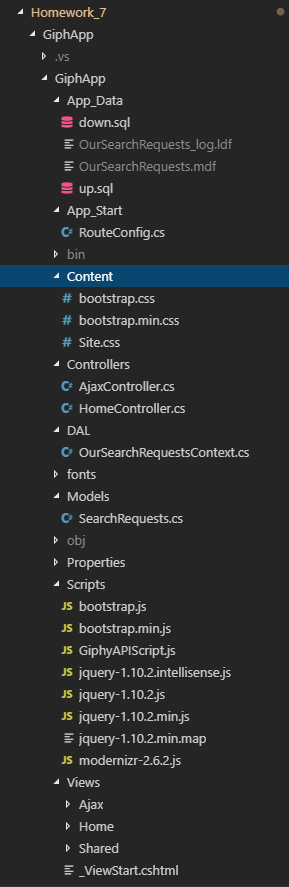
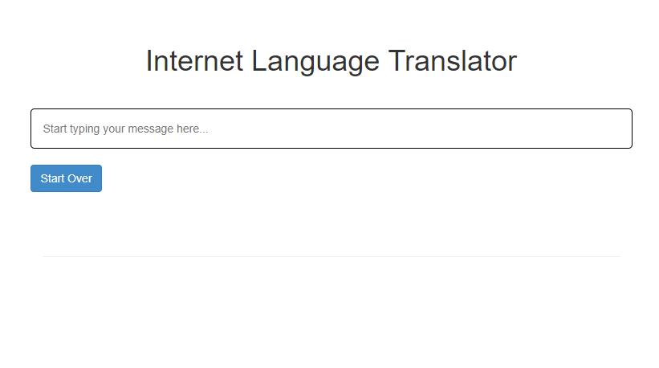
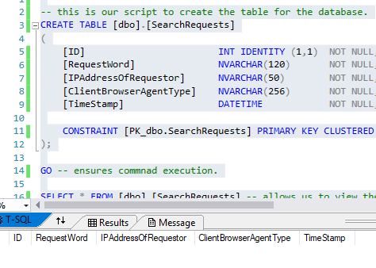
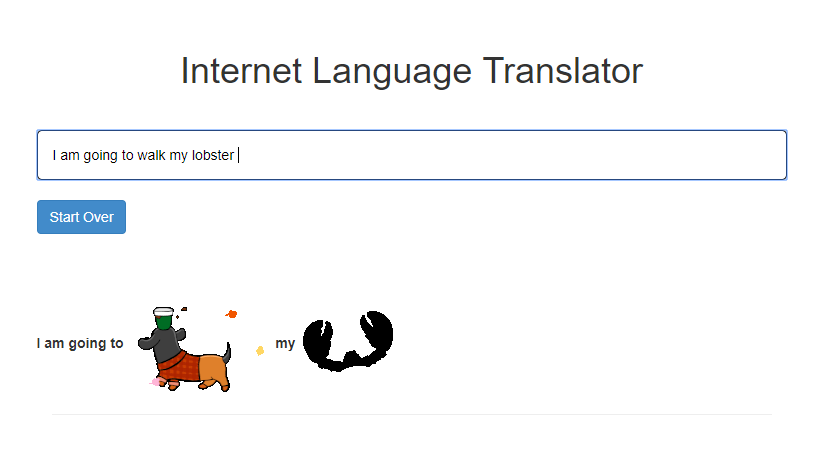
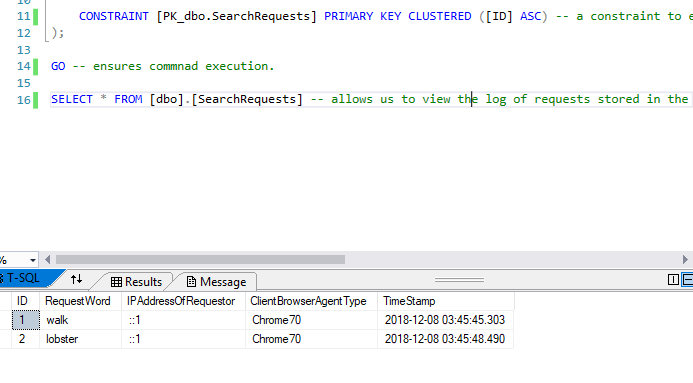

## Homework 7

This week our homework concerned how to write an MVC web application that employs AJAX to build responsive views via use of javascript and asynchronous calls to a web server. Specifically, we had to learn to use an existing external API to acquire data serverside in order to demonstrate the use of JSON and AJAX along with custom rounting URLs. The API used was [Giphy](https://developers.giphy.com/docs/).


### Homework 7 Links
1. [Home page](https://no-one-alone.github.io/)
2. [Assignment Page](http://www.wou.edu/~morses/classes/cs46x/assignments/HW7_1819.html)
3. [Code Repository](https://github.com/No-one-alone/no-one-alone.github.io)
4. [Final Video Demo](https://www.youtube.com/watch?v=mmsa3eg64tE&feature=youtu.be)


### Part 1: Creation of ASP.NET MVC 5 web app with Visual Studio IDE

This time we created a truly empty MVC 5 web application via selecting the "empty" project template with mvc checked when generating the project.

### Part 2: Editing the MVC 5 project and adding features.

At the conclusion of this project, we had these edited or added files.

```
up.sql
down.sql
RouteConfig.cs
Site.css
Web.config
HomeControllers.cs
AjaxController.cs
Index.cshtml
OurSeachRequestsContext.cs
SearchRequests.cs
GiphyAPIScript.js
Index.cshtml
_Layout.cshtml

```

We will proceed to cover the use of the files in the project.

### Part 2.1: Database creation and table ⟶ up.sql and down.sql components

We created our database under the App_Data folder and then added the relevant up.sql script

```sql


-- this is our script to create the table for the database.
CREATE TABLE [dbo].[SearchRequests]
(
	[ID]					    INT IDENTITY (1,1)	NOT NULL, -- our ID field
	[RequestWord]				NVARCHAR(120)		NOT NULL, -- our Field for "interesting" word requests
	[IPAddressOfRequestor]		NVARCHAR(50)		NOT NULL, -- our field for the ip address of the client
	[ClientBrowserAgentType] 	NVARCHAR(256)		NOT NULL, -- our field for the browser type used by the client.
	[TimeStamp] 				DATETIME			NOT NULL, -- our filed for storing time stamps of when requests were submitted.

	CONSTRAINT [PK_dbo.SearchRequests] PRIMARY KEY CLUSTERED ([ID] ASC) -- a constraint to ensure the table isn't dropped if key is used a foreign key in another table.
);

GO -- ensures commnad execution.

SELECT * FROM [dbo].[SearchRequests] -- allows us to view the log of requests stored in the database.

```

and down.sql script 

```sql
-- this is the script to drop the table of our database.
DROP TABLE [dbo].[SearchRequests];

```

As can be seen nothing really new here as far as the SQL needed.

### Part 2.2: Data Model ⟶ SearchRequests.cs component

We also created our related model class as seen here.

```cs

using System;
using System.Collections.Generic;
using System.Linq;
using System.Web;

// added this
using System.ComponentModel.DataAnnotations;

/// <summary>
/// This is our namespace for our model
/// </summary>
namespace GiphApp.Models
{
    /// <summary>
    /// This is our model class.
    /// </summary>
    public class SearchRequests
    {
        /// <summary>
        /// This is our Primary key.
        /// </summary>
        [Key]
        [Required]
        public int ID { get; set; }

        /// <summary>
        /// This is the client's IP address.
        /// </summary>
        [Required]
        public String IPAddressOfRequestor { get; set; }

        /// <summary>
        /// This is our entered word.
        /// </summary>
        [Required]
        public String RequestWord { get; set; }

        /// <summary>
        /// This is our client's browser type information.
        /// </summary>
        [Required]
        public String ClientBrowserAgentType { get; set; }

        /// <summary>
        /// This is the timestamp for when the request was made.
        /// </summary>
        [Required]
        public DateTime TimeStamp { get; set; } = DateTime.Now;
    }
}

```


### Part 2.3: Data Access Layer (DAL) ⟶ OurSearchRequestsContext.cs component

In turn, this lead to creating our data access layer file, OurSearchRequestsContext.cs, seen here.

```cs
//added these
using GiphApp.Models;
using System.Data.Entity;

/// <summary>
/// This is the namespace for our data access layer.
/// </summary>
namespace GiphApp.DAL
{
    /// <summary>
    /// This is our database context class.
    /// </summary>
    public class OurSearchRequestsContext : DbContext
    {
        /// <summary>
        /// This relates to our context.
        /// </summary>
        public OurSearchRequestsContext() : base("name=OurSearchRequests") { }

        /// <summary>
        /// This produces our database entry objects with automatic properties.
        /// </summary>
        public virtual DbSet<SearchRequests> Entries { get; set; }
    }
}

```


### Part 2.4: Only Landing/View page ⟶ _Layout.cshmtl component

We altered the layout of this part of the landing page mostly by removing the navbar and other elements from the standard pregenerated _Layout.cshtml file to arrive at this streamlined result.

```html

<!DOCTYPE html>
<html>
<head>
    <meta charset="utf-8" />
    <meta name="viewport" content="width=device-width, initial-scale=1.0">
    <title>@ViewBag.Title - for the internet</title>
    <link href="~/Content/Site.css" rel="stylesheet" type="text/css" />
    <link href="~/Content/bootstrap.min.css" rel="stylesheet" type="text/css" />
    <script src="~/Scripts/modernizr-2.6.2.js"></script>
</head>
<body>

    @*removed unncessary navbar, options, and spans.*@
    <div class="container body-content">
        @RenderBody()
        <hr />
    </div>

    <script src="~/Scripts/jquery-1.10.2.min.js"></script>
    <script src="~/Scripts/bootstrap.min.js"></script>

    @*added this to render our javascript.*@
    @RenderSection("GiphyAPIScript", required: false)

</body>
</html>

```

Note that we added the statement

```html

    @*added this to render our javascript.*@
    @RenderSection("GiphyAPIScript", required: false)

```

to the layout page for rendering the javascript.


### Part 2.5 Only Landing/View page ⟶ Index.cshtml

The landing page itself was defined mostly through the Index.cshtml file which provided the single view we needed for this project.

```cs

@*this is our file for defining the view of the homepage to the user.*@

@{
    ViewBag.Title = "Translator";
}

<h1>Internet Language Translator</h1>

@*this is our entry form for the user.*@
<form action="/Home/Index" method="get">
    <div class="row">
        <div class="col-sm-20">
            <input name="input text" id="textbox" placeholder="Start typing your message here..." />
        </div>
    </div>

    @* this creates a button for the user to click to clear the textbox of content.*@
    <br />
    <div class="row">

        <div>
            <input class="btn btn-primary" type="button" id="btnClear" value="Start Over" onClick="window.location.reload()">
        </div>

    </div>
</form>

<br />
<br />
<br />

@*this is where our output of entered text and translated GIF stickers are displayed.*@
<div class="row">
    <div id="dynamic-output">
        <!--The text and images will appear here as the user types them in.-->
    </div>
</div>

@* this our include @section for running our javascript file.*@
@section GiphyAPIScript
{
    <script src="~/Scripts/GiphyAPIScript.js" type="text/javascript"></script>
}

```


Note the employment of the @section to include our javascript file, GiphyAPIScript.js

```js

@section GiphyAPIScript
{
    <script src="~/Scripts/GiphyAPIScript.js" type="text/javascript"></script>
}

```


### Part 2.6:  Controller for the basic View ⟶ HomeController.cs

Here, we have our familar and utterly basic home controller for the view.

```cs

using System;
using System.Collections.Generic;
using System.Linq;
using System.Web;
using System.Web.Mvc;

/// <summary>
/// this is the namespace for our project solution.
/// </summary>
namespace GiphApp.Controllers
{
    /// <summary>
    /// This is the standard pre-built home controller class which extends controller.
    /// </summary>
    public class HomeController : Controller
    {

        // GET: Home
        // standard index action method.
        public ActionResult Index()
        {
            return View();
        }
    }
}

```


### Part 2.7:  Controller for the AJAX calls ⟶ AjaxController.cs

This is our controller for handling the AJAX calls.

```cs

// This is the Controller file created to handle the AJAX component.
using System;
using System.Collections.Generic;
using System.IO;
using System.Linq;
using System.Net;
using System.Web;
using System.Web.Mvc;

//added these
using GiphApp.DAL;
using GiphApp.Models;

/// <summary>
/// This is the namespace for our controller
/// </summary>
namespace GiphApp.Controllers
{
    /// <summary>
    /// This is our controller class for handling AJAX.
    /// </summary>
    public class AjaxController : Controller
    {
        // this creates a database context object for later use.
        private OurSearchRequestsContext database = new OurSearchRequestsContext();

        /// <summary>
        /// This our JsonResult method for obtaining GIFs for "interesting" words.
        /// </summary>
        /// <param name="enteredWord"> the word entered by the user.</param>
        /// <returns>the json output.</returns>
        [HttpGet]
        public JsonResult GetGiphyAPIimage(string enteredWord)
        {
            // this our string for the uri created from the giphy path, our secret giphy key, and our "interesting" word.
            string uri = "https://api.giphy.com/v1/stickers/translate?api_key=" +
                         System.Web.Configuration.WebConfigurationManager.AppSettings["SecretGiphyAPIKey"] +
                         "&s=" + enteredWord;

            // this creates our web request.
            WebRequest webRequest = WebRequest.Create(uri);

            // This obtains the necessary JSON data.
            Stream dataStream = webRequest.GetResponse().GetResponseStream();

            // This processes and parses the obtained JSON data.
            var processedData = new System.Web.Script.Serialization.JavaScriptSerializer()
                                  .DeserializeObject(new StreamReader(dataStream)
                                  .ReadToEnd());

            // This creates a search requests object for storing the relevant data that we wish to log to our database.
            SearchRequests searchRequestsEntry = new SearchRequests();

            // This stores the user host address.
            searchRequestsEntry.IPAddressOfRequestor = Request.UserHostAddress; 

            // This stores the entered word that was considered "interesting".
            searchRequestsEntry.RequestWord = enteredWord;

            // This stores the client's browser type.
            searchRequestsEntry.ClientBrowserAgentType = Request.Browser.Type;

            //This saves the request details to the database.
            database.Entries.Add(searchRequestsEntry);
            database.SaveChanges();
        
            // This returns the JSON data.
            return Json(processedData, JsonRequestBehavior.AllowGet);
        }
    }
}

```

Main differences compared to a more standard controller would be the use of a JsonResult method instead of an ActionResult method as well as the appropriate form of return e.g. Json(...) instead of View(...).

Also, present with the Json class is the necessary requests to obtain and process the json

```cs

  // this our string for the uri created from the giphy path, our secret giphy key, and our "interesting" word.
            string uri = "https://api.giphy.com/v1/stickers/translate?api_key=" +
                         System.Web.Configuration.WebConfigurationManager.AppSettings["SecretGiphyAPIKey"] +
                         "&s=" + enteredWord;

            // this creates our web request.
            WebRequest webRequest = WebRequest.Create(uri);

            // This obtains the necessary JSON data.
            Stream dataStream = webRequest.GetResponse().GetResponseStream();

            // This processes and parses the obtained JSON data.
            var processedData = new System.Web.Script.Serialization.JavaScriptSerializer()
                                  .DeserializeObject(new StreamReader(dataStream)
                                  .ReadToEnd());

```

and finally the code to add the details of each request as new entries to the database.

```cs
        // this creates a database context object for later use.
        private OurSearchRequestsContext database = new OurSearchRequestsContext();

        // This stores the user host address.
         searchRequestsEntry.IPAddressOfRequestor = Request.UserHostAddress; 

        // This stores the entered word that was considered "interesting".
        searchRequestsEntry.RequestWord = enteredWord;

        // This stores the client's browser type.
        searchRequestsEntry.ClientBrowserAgentType = Request.Browser.Type;

        //This saves the request details to the database.
        database.Entries.Add(searchRequestsEntry);
        database.SaveChanges();

```

### Part 2.8:  Javascript file for the AJAX calls to the Giphy API ⟶ GiphyAPIScript.js

Next, we have the javascript file which contains the actaul AJAX call, how it is specifed, and where the results are to be sent for our only view.


```js

/* This is our javascript file for the AJAX calls to the Giphy API. */

// This is our massive list of common verbs and adjectives that are to be excluded from being matched to possible images.
var excludedWords = [",", ".", "", "/", ";", "a", "an", "the", "i", "me", "we", "to", "for", "going",
    "of", "to", "you", "be", "is", "he", "she", "them", "this", "other", "not", "in", "toward", "and",

    ...

    "zany", "zealous", "zesty", "zippy", "zonked", "am", "have","with", "your","off", "what","can"];


// This sends the request to GIPHY Site.
// It takes our word that we may 
// want a GIF of, if it is "interesting.
function getGiphyImage(keyWord) {

    // this creates our url.
    var source = "Giphy/Image/" + keyWord;

    // This is the AJAX call itself.
    $.ajax({
        type: "GET",
        dataType: "json",
        url: source,
        success: showImage,
        error: ajaxErrorMessage
    });
}


// This function gives an error message to the user in the event that the image cannot be loaded.
function ajaxErrorMessage() {
    alert("Image cannot be loaded!!!");
}

// This function displays the GIF image to the client.
function showImage(dataOfImage) {

    // This is the uri of the GIF to be displayed.
    var gifImage = dataOfImage.data.images.fixed_height_small.url; 

    // This appends the GIF image to the HTML document via jQuery.
    $("#dynamic-output").append(" &nbsp;");
}

// This is the main function for our javascript i.e. our program entry point.
function main() {
    $("#textbox").keypress(function (k) {
        if (k.keyCode == 32) { // Checks if space has been entered into input textbox.
            var text = document.getElementById("textbox").value; // this retrieves the text from the input textbox.
            text = text.split(" "); // This splits the text into an array of words.
            lastWord = text[text.length - 1]; // this retrieves the last word of the array.
            var lowerWord = lastWord.toLowerCase(); // this converts the word to all lowercase in order to compare against the words in our above list.

            // This will check if the word is in our list of excluded words.
            if (excludedWords.includes(lowerWord)) { 
                $("#dynamic-output").append("<label>" + lastWord + "</label>&nbsp;") // this will simply display the entered word as output.
            }
            else { 
                getGiphyImage(lastWord); // this will display the GIF image translation for the word if it is not in the above array.
            }
        }
    });
}

// This accesses the document and triggers the main function to get things started.
$(document).ready(main); 


```


### Part 2.9:  Config file for non-fault route ⟶ RouteConfig.cs

As part of this program, we had to write our own custom routing rule in App_Start\RouteConfig.cs for retrieving data via AJAX with appropriate REST-like URL.


```cs


using System;
using System.Collections.Generic;
using System.Linq;
using System.Web;
using System.Web.Mvc;
using System.Web.Routing;

/// <summary>
/// this the namespace for our giph app solution.
/// </summary>
namespace GiphApp
{
    /// <summary>
    /// Our RouteConfig class.
    /// </summary>
    public class RouteConfig
    {
        /// <summary>
        /// Our standard boiler plate function for routes.
        /// </summary>
        /// <param name="routes"></param>
        public static void RegisterRoutes(RouteCollection routes)
        {
            routes.IgnoreRoute("{resource}.axd/{*pathInfo}");

            // This is the new non-default custom route we created.
            routes.MapRoute(
                name: "GiphyImages",
                url: "Giphy/Image/{enteredWord}",
                defaults: new { Controller = "Ajax", action = "GetGiphyAPIimage", enteredWord = UrlParameter.Optional }

                );

            // This is the default route.
            routes.MapRoute(
                name: "Default",
                url: "{controller}/{action}/{id}",
                defaults: new { controller = "Home", action = "Index", id = UrlParameter.Optional }
            );
        }
    }
}


```

### Part 2.10:  CSS file for styling View ⟶ Site.css

Finally, this is the Site.css file for styling the look of our only view.

```css

/* this styles our only view page.*/

/*this styles the header element*/
h1 {
    text-align: center;
}

/*This sets the dimensions of the textbox*/
#textbox {
    margin-top: 30px;
    padding-left: 15px;
    width: 100%;
    height: 50px;
    border: 1px solid;
    border-radius: 5px;
}

/* this styles the body element*/
body {
    padding-top: 50px;
    padding-bottom: 30px;
}


/* this sets the padding to keep from hitting the edges */
.body-content {
    padding-left: 20px;
    padding-right: 20px;
}

```


### Part 2.11:  Connection string and file path for secret Giphy API key ⟶ Web.config

An addendum not to be missed is the manually adding of the connection string and the using of the "file" attribute to specify the config file with the secret giphy key.

```html

  <!--Added connection string-->

  <connectionStrings>
    <add name="OurSearchRequests" connectionString="Data Source=(LocalDB)\MSSQLLocalDB;AttachDbFilename=C:\Users\khorb\CS_SENIOR_PROJECT\CS_460\no-one-alone.github.io\Homework_7\GiphApp\GiphApp\App_Data\OurSearchRequests.mdf;Integrated Security=True" providerName="System.Data.SqlClient" />
  </connectionStrings>
  
    <!--added this path to config file with secret Giphy Key-->
  <appSettings file="..\..\..\..\AppSettingsSecrets.config">

```

Here, the actual Giphy key has been removed and replaced by "XXXXXX" for security regions.

In actual operation, the value would be that of the Giphy key with the config file itself left outside off the repository.

```cs

<appSettings>
    <add key="SecretGiphyAPIKey" value="XXXXXXXXXXXXXXXXXXXXXXX"/>
</appSettings>

```

### Part 3: Final Results


This shows how the overall file structure of my homework #7 project was organized in Visual Studio Code which is different compared to the last homework due to the use of the empty project template.




And this is a picture of the landing page of the web app.



Furthermore, the state of the database can also be seen here.




Lastly, we can see this page in action here with the translated GIF output.



Followed by looking at the updated database



As we can see, everything has been implemented regarding our ASP.NET MVC 5 web application and can be seen to work both according to the above screenshots and the video demo in the link at the top.

In general, this was a very trying homework in becoming aquainted with creating and utilizing the ASP.NET MVC 5 platform for creating a responsive single page/view using AJAX.