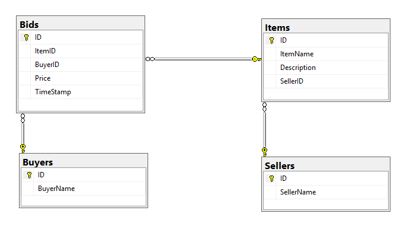

## Homework 8

This week our homework was to write a MVC web application that uses a multi-table, relational database instance that we created ourselves given a set of entity relationships. This required understanding how to define both primary and foreign key properties for the tables as well constraints on how tables can be dropped. The overall forcus was on learning how to rapidly implement CRUD functionality with non-trivial models, the different kinds of LINQ statements required to extract data from our database and organize it in various ways. This involved more practice with the "Code First with an Existing Database" workflow, using strongly typed views, gaining more experince with LINQ queries, and implementing AJAX functionality where needed. This is effectively a means of practicing for the hands-on programming final of the term.

### Homework 8 Links
1. [Home page](https://no-one-alone.github.io/)
2. [Assignment Page](http://www.wou.edu/~morses/classes/cs46x/assignments/HW8_1819.html)
3. [Code Repository](https://github.com/No-one-alone/no-one-alone.github.io)
4. [Final Video Demo](https://www.youtube.com/watch?v=DU2guLOI0gY&feature=youtu.be)

### Part 3: Final Results

This is the E-R diagram of our database schema for the database we made for homework 8. Note the relations between tables are in line with those described for the Bids, Items, Buyers, and Sellers entities in the homework 8 specification.

