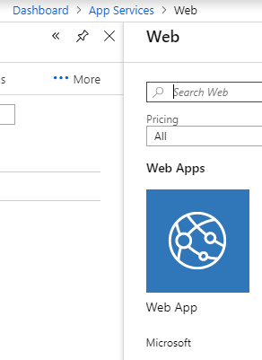
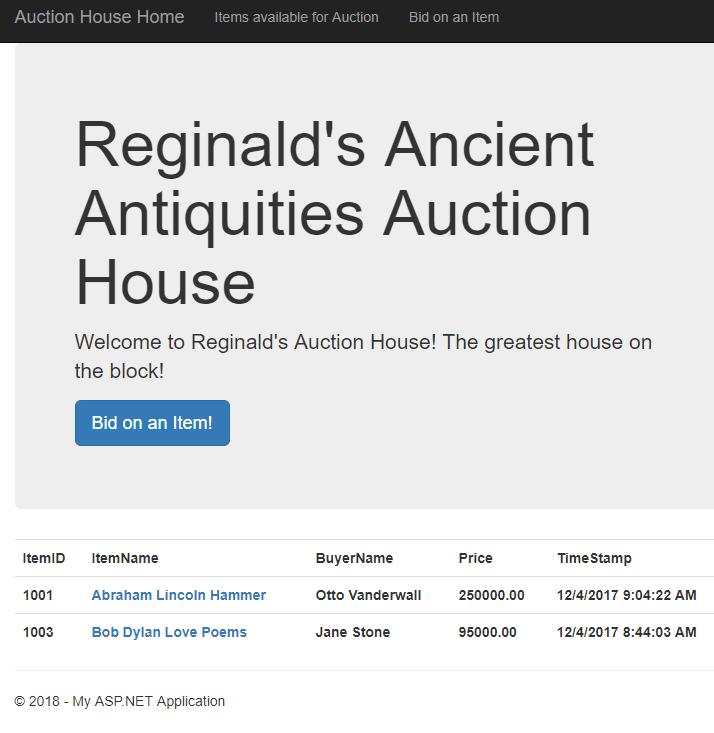

## Homework 9

Our final homework was to deploy a complex MVC web application, that we had writtion previously as Homework 8, to the cloud. Specifically, this involved learning how to provision and deploy Homeworks 8's database and main program to the Cloud via Azure. This involved creating an account at [Microsoft Azure](https://azure.microsoft.com/en-us/free/), then creating the database remotely on Azure, followed by deploying the homework 8 web app on Azure and using the previously setup database.


### Homework  Links
1. [Home page](https://no-one-alone.github.io/)
2. [Assignment Page](http://www.wou.edu/~morses/classes/cs46x/assignments/HW9_1819.html)
3. [Code Repository](https://github.com/No-one-alone/no-one-alone.github.io)
4. [Final Video Demo](https://www.youtube.com/watch?v=DU2guLOI0gY&feature=youtu.be)
5. [Final Site Demo](https://auctionhousefinal.azurewebsites.net)


### Part 3: Cloud Deployment process with Azure

#### Step 1 - Account
Our first step was to create an account at [Azure](https://azure.microsoft.com/en-us/free/)


#### Step 2 - Resource group
Once that step was complete, we then proceeded to create our recource group for the deployment of the project.


#### Step 3a - SQL database
Once that was done, we proceeded to create the database


#### Step 3b - Firewall
And set the firewall to ensure our programs's connection didn't get blocked.


#### Step 4 - Replace web.config connection string

We then retrieved the connection string we needed to from the sql database part of azure and used it to replace the original connection string in Homework 8's web.config file as seen here. Note that the user id and the database password have been replaced with X's. In normal, usage, the X's would be filled in by the user id and passwork. Furthermore, user id really means the server admin login otherwise one could get confused.

```cs
<connectionStrings>
  <add name="AuctionHouseContext" connectionString="Server=tcp:auctionhouseserver.database.windows.net,1433;Initial Catalog=AuctionHouseDatabase;Persist Security Info=False;User ID=XXXXX;Password=XXXXXX;MultipleActiveResultSets=False;Encrypt=True;TrustServerCertificate=False;Connection Timeout=30;" providerName="System.Data.SqlClient" /> 
<!--  <add name="AuctionHouseContext" connectionString="data source=(LocalDB)\MSSQLLocalDB;attachdbfilename=|DataDirectory|\OurAuctionHouse.mdf;integrated security=True;MultipleActiveResultSets=True;App=EntityFramework" providerName="System.Data.SqlClient" /> -->
</connectionStrings>
</configuration>

```

#### Step 5 - Connect up.sql file with new connection string

Next, the up.sql and down.sql scripts are connected to Azure with the Azure option seen here instead of the local db option we have been using up until now. Note that it require inputting the password yet again on top of the user id/server admin login credentials.


#### Step 6 - Run up.sql

Now, one creates the database tables by running the up.sql of the project in visual studio just like we have done in previous homeworks.

#### Step 7 - add Web App on Azure

This is followed by going back to azure, going to app services, clicking add, and selecting the Web App icon option.



#### Step 8 - Name the Azure Web App

You give this app a name and then select the existing resource group followed by clicking the create button.


#### Step 9 - Fill in Web App "entries"

Now, one goes to the just created web app's application settings page and then fills in the "Value" entry with the complete connection string from your web.config file including the present user id and password along with the quotes around the connection string!!! In addition, select SQLServer for the "Type" entry. Note that the "connection string" entry actually just means the name of the database should be inputted. And finally click save.


#### Step 10 - Publish in Visual Studio

As this point, go to visual studio look under build for the new Azure "Publish" option, select it, start, and select existing again, then select the middle level in the area textbox,and finally press okay.


One can then republish the web app if edits are made to the code so long as they don't involve the connection string or the database setup or schema itself by simply clicking the publish button and waiting for a minute or two until the app pops up in your browser just like with your local database.


#### Step Zeroth - Final Destination!

Now just lay back and enjoy the result of your succesful deployment of the web app.



I hope these instructions and steps show that I have fully engaged myself in the cloud deployment process using Azure and that this list will serve me well on the final.


